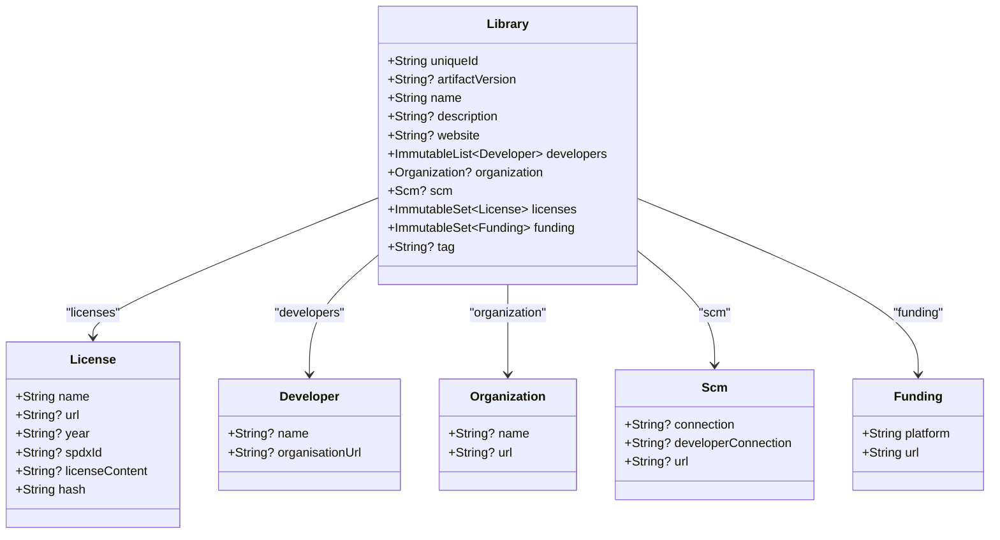

# Library, License, and Related Entities

This document provides an authoritative guide to the core data structures within AboutLibraries that model third-party library metadata. It focuses on the primary entities — namely **Library**, **License**, **Funding**, **Developer**, **Organization**, and **SCM** — detailing their key properties, relationships, and extension utilities. Understanding these entities empowers you to efficiently access, present, and manipulate comprehensive dependency and license information embedded in your projects.

---

## Overview of Main Entities

### Library
Represents a third-party software dependency with rich metadata. It consolidates identity, versioning, contributors, licensing, hosting, and funding details to provide a full portrait of the library used in your project.

#### Key Properties:
- `uniqueId` (String): A guaranteed unique identifier, typically the artifact coordinates such as `group:name`.
- `artifactVersion` (String?): The specific version of the library artifact.
- `name` (String): The library name, suitable for display.
- `description` (String?): An optional summary describing the library’s purpose or features.
- `website` (String?): URL to the official homepage of the library.
- `developers` (Immutable List of `Developer`): Contributors or authors of the library.
- `organization` (Optional `Organization`): The corporate or group entity behind the library.
- `scm` (Optional `Scm`): Source code management URLs and connection details.
- `licenses` (Immutable Set of `License`): One or more associated licenses governing usage.
- `funding` (Immutable Set of `Funding`): External funding platforms supporting the project.
- `tag` (String?): Optional label for categorization or tagging.

#### Usage Example:
```kotlin
val exampleLibrary = Library(
    uniqueId = "com.mikepenz:fastadapter",
    artifactVersion = "5.5.1",
    name = "FastAdapter Library",
    description = "Fast and easy to use adapter library.",
    website = "https://github.com/mikepenz/FastAdapter",
    developers = listOf(Developer("Mike Penz", null)).toImmutableList(),
    organization = null,
    scm = Scm(
        connection = "scm:git@github.com:mikepenz/FastAdapter.git",
        developerConnection = "scm:git@github.com:mikepenz/FastAdapter.git",
        url = "https://github.com/mikepenz/FastAdapter"
    ),
    licenses = setOf(
        License(
            name = "Apache License 2.0",
            url = "https://www.apache.org/licenses/LICENSE-2.0",
            year = null,
            spdxId = "Apache-2.0",
            licenseContent = null,
            hash = "29162c4a2ae4d7ec6b3925cbde680772"
        )
    ).toImmutableSet(),
    funding = emptySet<Funding>().toImmutableSet(),
    tag = null
)
```

---

### License
Defines the legal framework governing code use, redistribution, and modification rights for a particular library or its components.

#### Key Properties:
- `name` (String): Full name of the license, e.g., "Apache License 2.0".
- `url` (String?): Link to the official or hosted license text.
- `year` (String?): Optional copyright year associated with the license.
- `spdxId` (String?): Standardized identifier per [SPDX](https://spdx.org/licenses/) to recognize common license types.
- `licenseContent` (String?): The full textual content of the license, downloaded or parsed.
- `hash` (String): A unique hash string computed from license content, used for detection and deduplication.

#### Equality & Identity:
License instances are considered equal if their `hash` values match, ensuring that different licenses with the same textual content unify as one entity.

#### Code Example:
```kotlin
val apacheLicense = License(
    name = "Apache License 2.0",
    url = "https://www.apache.org/licenses/LICENSE-2.0",
    year = "2021",
    spdxId = "Apache-2.0",
    licenseContent = "...full license text...",
    hash = "29162c4a2ae4d7ec6b3925cbde680772"
)
```

---

### Developer
Models an individual or contributor involved in creating or maintaining a library.

#### Properties:
- `name` (String?): The developer’s name.
- `organisationUrl` (String?): Optional reference to the developer’s organization website.

### Organization
Describes the corporate or group entity responsible for the library’s development.

#### Properties:
- `name` (String?): The organization’s name.
- `url` (String?): Link to the organization’s website.

### Scm (Source Code Management)
Captures the version control system information enabling source access.

#### Properties:
- `connection` (String?): The SCM connection string (often used for internal connectivity).
- `developerConnection` (String?): Special connection URL or string for developer-level access.
- `url` (String?): Website URL to SCM repository.

### Funding
Provides information about external funding sources backing the development.

#### Properties:
- `platform` (String): Name of the funding platform (e.g., "Patreon", "Open Collective").
- `url` (String): URL directing to the funding page.

### Relationships
All these entities are aggregated within the `Library` structure to form a comprehensive dependency profile:
- A Library has many Licenses and Developers.
- It optionally includes a single Organization and SCM info.
- Funding sources may be multiple, representing sponsorships or backing.

---

## Serialization & Parsing

AboutLibraries uses these entities internally in serialized forms to persist and reload library metadata efficiently across environments.

- The `Libs` class encapsulates the entire dataset, holding immutable collections of Libraries and Licenses.
- Serialization uses Kotlin’s `Serializable` annotations.
- Parsing methods convert JSON data into these entities, enabling runtime access (see `Libs.Builder.withJson()`).

## Extension Properties

To streamline information consumption and presentation, extension properties are available:

- **Library.author**
  - Returns a composite string of all developer names if available.
  - Falls back to the organization's name if no developers are listed.

- **Library.license**
  - Provides easy access to the first license from the library’s license set (common use case when licensing is straightforward).

- **License.htmlReadyLicenseContent**
  - Formats license content with HTML line breaks (`<br />`) for rendering in rich text components.

- **License.strippedLicenseContent**
  - Converts HTML line breaks back to newline characters for plain text display contexts.

- **Library.htmlReadyLicenseContent** and **Library.strippedLicenseContent**
  - Compose full license text, concatenating multiple licenses with appropriate spacing and formatting.

---

## Practical Developer Workflow

### Loading and Parsing Metadata
To integrate AboutLibraries data:

1. Obtain generated JSON metadata (`aboutlibraries.json`) from your build or manual export.
2. Use the `Libs.Builder().withJson(jsonString).build()` method to parse metadata into immutable data objects.
3. Access `libs.libraries` for your list of libraries and their related information.

### Access Library Attributes
Use `library.uniqueId`, `library.name`, `library.licenses`, etc., to obtain specific information for display or compliance checks.

### Example Snippet
```kotlin
val libs = Libs.Builder().withJson(metadataJson).build()
libs.libraries.forEach { lib ->
    println("Library: ${lib.name} (version: ${lib.artifactVersion})")
    println("Author(s): ${lib.author}")
    lib.licenses.forEach { license ->
        println("License: ${license.name} - ${license.url ?: "No URL"}")
    }
}
```

### Common Pitfalls
- Licenses without SPDX IDs should be reviewed carefully as they might require manual verification.
- Multiple licenses per library need consolidated UI treatment to avoid duplication and user confusion.
- Always use provided immutable collections for thread-safety and consistent data handling.

---

## Visualizing Relationships


---

## Additional Resources
- The `Libs` container class and its `Builder` for JSON loading.
- Guides on how to generate and export library metadata.
- Compose UI integration documentation for visualizing license data.
- Troubleshooting guides for metadata parsing and license strict modes.

---

By mastering the use of these entities, you'll unlock the full potential of AboutLibraries for comprehensive, accurate, and automated open-source license management in your applications.

---

## See Also
- [Libs Main Container and Builder](/api-reference/core-data-models/libs-entity-reference)
- [Data Parsing and Serialization](/api-reference/core-data-models/data-parsing-serialization)
- [Compose Component Customization](/api-reference/compose-api/compose-components-customization)
- [Generating Library Metadata Guide]( /getting-started/configuration-and-first-run/generate-metadata)
- [Troubleshooting Common Scenarios]( /guides/best-practices-workarounds/troubleshooting-common-scenarios)

---

## Source Code
<Source url="https://github.com/mikepenz/AboutLibraries" paths={[{"path": "aboutlibraries-core/src/commonMain/kotlin/com/mikepenz/aboutlibraries/entity/Library.kt", "range": "1-110"},{"path": "aboutlibraries-core/src/commonMain/kotlin/com/mikepenz/aboutlibraries/entity/License.kt", "range": "1-50"},{"path": "aboutlibraries-core/src/commonMain/kotlin/com/mikepenz/aboutlibraries/Libs.kt", "range": "1-85"}]} />
