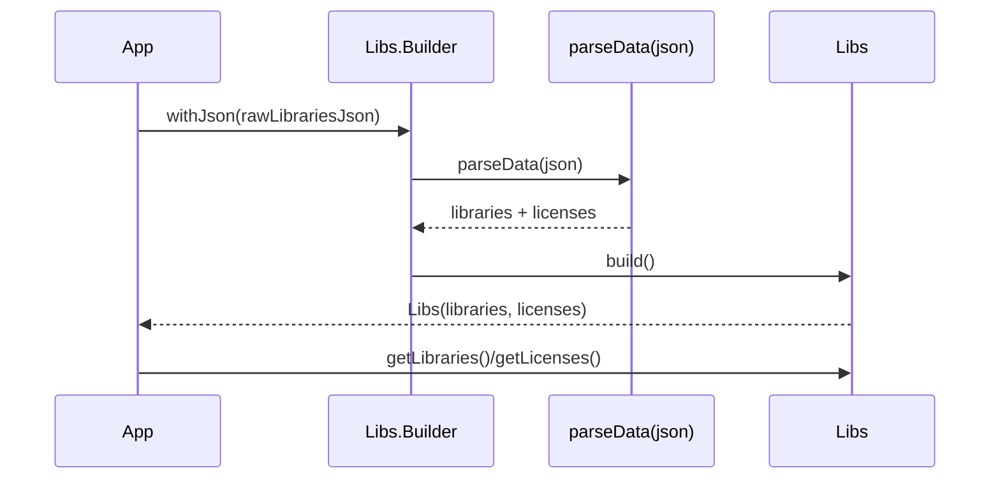

# Libs Main Container and Builder

## Overview

The `Libs` class serves as the primary entry point for accessing the metadata about libraries and licenses generated by the AboutLibraries Gradle plugin. It encapsulates comprehensive information about all third-party dependencies used in a module, including detailed metadata for each library and its associated licenses.

This page documents how to leverage the `Libs` class and its nested `Builder` class to load, parse, and access this metadata effectively at runtime. This enables applications or Compose layers to display, analyze, or integrate license and library information seamlessly.

---

## Core Concepts

- **Libraries:** Immutable list of all dependency libraries collected during the build.
- **Licenses:** Immutable set of all licenses referenced by those libraries.
- **Builder Pattern:** Used to parse raw JSON metadata and produce a `Libs` instance.

These components power a data-driven approach to querying and presenting library and license details in various runtime environments.

---

## Using the `Libs` Class

### Instantiation

The `Libs` class is a data class that holds two main collections:

- `libraries`: An immutable list of `Library` entities.
- `licenses`: An immutable set of `License` entities.

You do not instantiate `Libs` objects directly. Instead, use the `Libs.Builder` to load and parse the metadata.

```kotlin
val libs: Libs = Libs.Builder()
    .withJson(aboutLibrariesJsonString) // Provide JSON data as string
    .build()

val allLibraries = libs.libraries
val allLicenses = libs.licenses

for (library in allLibraries) {
    println("Library: ${library.name} - Version: ${library.artifactVersion}")
}
```

### Accessors

The `Libs` class provides the following key accessors:

- `getLibraries()`: Returns the immutable list of all `Library` objects.
- `getLicenses()`: Returns the immutable set of all `License` objects.

Each `Library` object contains richly detailed information about a dependency, such as its unique ID, version, description, associated licenses, developers, SCM info, funding, and more.

---

## Builder Class: Loading and Parsing Metadata

The `Libs.Builder` class is designed to facilitate the construction of a `Libs` instance by parsing the JSON metadata file generated by the Gradle plugin.

### Workflow

1. **Supply JSON Metadata:** Use `.withJson(String)` to provide the raw JSON string containing library and license metadata.
2. **Build the Libs Instance:** Call `.build()` to parse the JSON, sort libraries alphabetically by name (case insensitive), and generate immutable collections.

```kotlin
val builder = Libs.Builder()
val libs = builder
    .withJson(rawJsonString)
    .build()

println("Total Libraries Loaded: ${libs.libraries.size}")
```

### Error Handling

If the JSON data is not provided or is invalid, the `build()` method throws an `IllegalStateException` with instructions on how to properly provide the data, including platform-specific tips.

```kotlin
try {
    val libs = Libs.Builder()
        .build() // error: no JSON provided
} catch (e: IllegalStateException) {
    println("Error: ${e.message}")
}
```

---

## Data Flow and Lifecycle

At build time, the Gradle plugin generates a JSON file (`aboutlibraries.json`) containing detailed library and license data. At runtime:

1. The app or service loads this JSON metadata as a string.
2. The `Libs.Builder` parses the JSON to produce a `Libs` instance.
3. The `Libs` instance exposes immutable lists and sets of `Library` and `License` entities.
4. Your app can query this data to render UI components, perform compliance checks, or generate reports.

---

## Practical Tips and Best Practices

- **Always Provide JSON:** Use the recommended loading methods per platform (e.g., Android raw resource, Compose Multiplatform resource) to supply JSON to the builder.
- **Immutable Data Usage:** `Libs` returns immutable collections, ensuring thread safety and consistent state.
- **Sorted Libraries:** Libraries are sorted alphabetically to facilitate predictable display or searching.
- **Exception Guidance:** Follow exception messages closely; they include hints tailored for Android, Compose, or custom setups.
- **Integration with Compose UI:** `Libs` instances power the Compose `LibrariesContainer` for quick UI visualization.

---

## Example: Android Usage

```kotlin
val libs = Libs.Builder()
    .withContext(context) // extension loading JSON from raw resources on Android
    .build()

val firstLibrary = libs.libraries.firstOrNull()
Log.i("AboutLibraries", "First library name: ${firstLibrary?.name}")
```

## Example: Compose Multiplatform Loading

```kotlin
val libs = Libs.Builder()
    .withJson(composeResourceJsonString) // load JSON string from compose-resources
    .build()

LibrariesContainer(libraries = libs.libraries, modifier = Modifier.fillMaxSize())
```

---

## Related Classes

The `Libs` class depends on rich entity classes describing libraries, licenses, and their metadata:

- `com.mikepenz.aboutlibraries.entity.Library`
- `com.mikepenz.aboutlibraries.entity.License`
- `com.mikepenz.aboutlibraries.entity.Developer`
- `com.mikepenz.aboutlibraries.entity.Organization`
- `com.mikepenz.aboutlibraries.entity.Scm`
- `com.mikepenz.aboutlibraries.entity.Funding`

These entities model the detailed attributes for display and analysis.

---

## Troubleshooting

<AccordionGroup title="Common Issues and Resolutions">
<Accordion title="Missing JSON Data Exception">
If the `build()` method throws an `IllegalStateException` complaining about missing data, ensure you have provided JSON via `withJson()` or the platform-specific extension such as `withContext()` on Android.

```kotlin
Libs.Builder().withJson(jsonString).build()
```

or

```kotlin
Libs.Builder().withContext(context).build()
```

This error is the most frequent when the aboutlibraries.json file isn't bundled or loaded correctly.
</Accordion>
<Accordion title="Malformed JSON Causes Parsing Failure">
Verify that the JSON metadata is correctly formed. Improperly serialized JSON or partial file content will lead to deserialization errors.

Use tools like JSON validators or pretty printers to verify your JSON source.
</Accordion>
<Accordion title="Unexpected Empty Libraries List">
If runtime libraries list is empty, confirm that the metadata file is correctly generated and included during the build process.

Check Gradle plugin configurations and ensure the `exportLibraryDefinitions` task completes successfully.
</Accordion>
</AccordionGroup>

---

## Further Reading and Links

- [Generating Library Metadata](../../getting-started/configuration-and-first-run/generate-metadata)
- [Integrating Library Data into Your App](../../getting-started/configuration-and-first-run/first-app-integration)
- [Core Data Models Reference: Library, License Entities](./library-license-entities)
- [Compose UI API: LibrariesContainer](../../api-reference/compose-api/compose-librariescontainer-api)
- [Gradle Plugin Tasks & Configuration](../../api-reference/gradle-plugin-api/plugin-tasks-and-configuration)

---

## Summary

The `Libs` class with its `Builder` is the cornerstone for consuming generated dependency metadata for third-party libraries and licenses in AboutLibraries. By parsing the JSON metadata generated at build time, it provides reliable, immutable, and structured access to all library and license information your app or tooling needs for display, compliance, and reporting.

---

# Diagram: Metadata Loading Workflow



---

