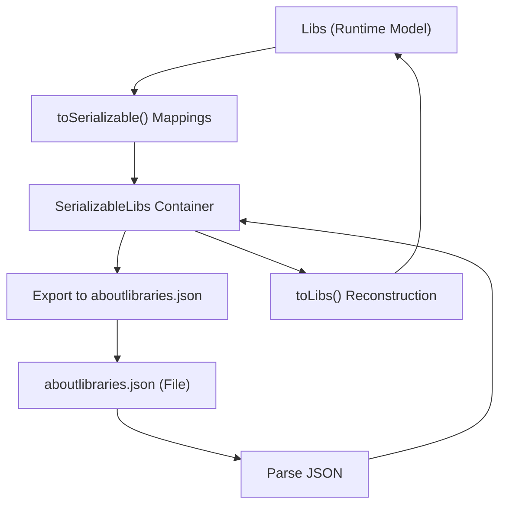

# Plugin Mappings & Utility Extensions

This page documents the key classes and extension utilities used by the AboutLibraries Gradle plugin to interpret, map, and post-process library and license information gathered during build time. These mappings enable the plugin and runtime modules to serialize, export, and reconstruct comprehensive metadata about your project’s third-party dependencies. You will learn about the serialization containers, hash generation, filtering and duplication handling configurations, and the per-variant export mechanisms that ensure variant-specific metadata accuracy.

---

## Overview

The AboutLibraries plugin internally represents library and license data through a set of serializable container classes. These classes serve as the interchange format enabling metadata to be written to JSON files and later transformed back into immutable Kotlin objects for runtime consumption. This page focuses specifically on these mapping classes and utility extensions that form the foundation of the plugin’s data handling pipeline.

Understanding these classes is essential if you wish to customize or extend how metadata is processed or exported.

---

## Serializable Container Classes

At the core of the plugin’s internal data handling are the `Serializable*` classes, implemented as `Serializable` Kotlin data classes. They provide a lightweight representation of the main entities defined in the `aboutlibraries-core` data model.

### Key Serializable Entities

- **SerializableLibs**
  - Top-level container for the entire metadata export
  - Contains a list of `SerializableLibrary` and a set of `SerializableLicense` objects

- **SerializableLibrary**
  - Represents a single library dependency
  - Contains unique ID, artifact version, name, description, URLs, developers, organization, SCM details, associated licenses, funding sources, and an optional tag

- **SerializableLicense**
  - Represents license metadata including name, URL, SPDX identifier, license text content, year, and a unique hash for content verification

- **SerializableDeveloper, SerializableOrganization, SerializableScm, SerializableFunding**
  - Represent auxiliary entities linked to libraries (developers, organizations, source control management links, funding platforms)

### Example Structure

```kotlin
internal data class SerializableLibs(
    val libraries: List<SerializableLibrary>,
    val licenses: Set<SerializableLicense>,
) : Serializable

internal data class SerializableLibrary(
    val uniqueId: String,
    val artifactVersion: String?,
    val name: String,
    val description: String?,
    val website: String?,
    val developers: List<SerializableDeveloper>,
    val organization: SerializableOrganization?,
    val scm: SerializableScm?,
    val licenses: Set<SerializableLicense> = emptySet(),
    val funding: Set<SerializableFunding> = emptySet(),
    val tag: String? = null,
) : Serializable
```

Each of these classes implements the `Serializable` interface, enabling Kotlin serialization to strip down the metadata for export.

---

## Mapping Functions and Conversions

To bridge the runtime entities (`Libs`, `Library`, `License`, etc.) with their serializable counterparts, the plugin defines internal extension functions:

- **toSerializable()**
  - Converts runtime objects to serializable container objects ready for JSON export

- **toLibs()**
  - Constructs the runtime `Libs` object from serialized data by mapping back from `SerializableLibs`

### Sample Conversion Flow

```kotlin
// Converts a Libs instance to its serializable representation
internal fun Libs.toSerializable() = SerializableLibs(
    libraries.map { lib -> SerializableLibrary(
        lib.uniqueId, ... other fields ...
    )},
    licenses.map { SerializableLicense(...) }.toSet()
)

// Converts SerializableLibs back to Libs
internal fun SerializableLibs.toLibs() = Libs(
    libraries.map { lib -> Library(
       lib.uniqueId, ... other fields ...
    )}.toImmutableList(),
    licenses.map { License(...) }.toImmutableSet()
)
```

### Rationale
These mappings decouple the internal data representations from serialized formats, providing stability, control over serialization specifics, and the ability to omit or modify fields for export purposes.

---

## Hash Generation & License Content Verification

Each license in the metadata includes a `hash` field — a unique fingerprint derived from the license content.

- The hash supports quick equality checks and filtering
- It enables efficient referencing of licenses by unique identifiers instead of duplicating content

This mechanism ensures licenses are tracked precisely, preventing duplicate entries and aiding strict license compliance verification.

---

## Field Filtering and Duplication Configuration

The plugin offers the possibility to exclude specific fields globally or per class in the exported JSON, allowing you to tailor metadata size and content.

- **Exclude Fields**
  - Defined in plugin configuration (`aboutLibraries.export.excludeFields`)
  - Useful when certain fields (e.g., `developers`, `funding`, or `License.name`) are unnecessary or sensitive in your export

- **Duplication Modes and Rules**
  - **DuplicationMode** (e.g., `LINK`) affects how duplicated dependencies are handled (merged or linked)
  - **DuplicationRule** defines criteria to identify duplicates (e.g., `SIMPLE` matching based on basic identifiers)

These controls help streamline the metadata set and reduce noise, especially for large projects with overlapping dependencies.

---

## Per-Variant Export Mechanics

AboutLibraries supports multiple build variants and output formats via the `exports` configuration block in the Gradle plugin.

- You can declare multiple named exports per variant
- Each export controls an `outputFile` destination and formatting options such as `prettyPrint`

Example snippet:

```kotlin
exports {
    create("jvm") {
        outputFile = file("files/jvm/aboutlibraries.json")
    }
    create("wasmJs") {
        outputFile = file("files/wasmJs/aboutlibraries.json")
    }
}
```

This per-variant strategy ensures that metadata generated for one platform or flavor does not inadvertently pollute another, supporting clean multiplatform deliverables.

---

## Utility Extensions

Several internal Kotlin extension properties enhance data access and transformation convenience.

Examples include:

- Getting the first license from a `Library`
- Obtaining an author string from developers or the organization
- Formatting license content to be HTML-ready by replacing newlines with `<br />`

### Example

```kotlin
internal val Library.license: License?
    get() = licenses.firstOrNull()

val Library.author: String
    get() = developers.takeIf { it.isNotEmpty() }?.map { it.name }?.joinToString(", ") ?: organization?.name ?: ""

internal val License.htmlReadyLicenseContent: String?
    get() = licenseContent?.replace("\n", "<br />")
```

These utilities improve integration with UI components and runtime processing by abstracting common data derivations.

---

## Troubleshooting and Best Practices

- Ensure the serializable containers stay in sync with the core entities to avoid serialization errors
- Use the Gradle plugin's configuration options to filter out unnecessary fields and reduce JSON file size
- Leverage duplication modes to handle complex projects with overlapping dependencies efficiently
- Test per-variant exports thoroughly to validate correct metadata outputs for different build flavors
- When customizing extensions, maintain immutability and serialization compatibility

---

## References & Further Reading

- [Libs Main Container and Builder](./libs-entity-reference) — to understand the main runtime data container
- [Library, License, and Related Entities](./library-license-entities) — for detailed entity specifications
- [Data Parsing and Serialization](./data-parsing-serialization) — for JSON parsing and serialization flows
- [Plugin Tasks & Configuration Extension](./plugin-tasks-and-configuration) — how to configure the Gradle plugin exports
- [Modify Library and License Information](../../guides/advanced-integration/modifying-library-license-info) — customizing metadata via JSON files

---

### Plugin Internal Diagram — Data Flow



This diagram highlights how the plugin serializes runtime data into a container, exports it as JSON, and later re-parses it for runtime use.

---

For advanced plugin customization or meta data manipulation, understanding these mapping and utility classes is crucial, as they govern the lifecycle of your library and license information from build time through runtime consumption.

---

<Check>
- To extend metadata export behaviors, customize or contribute to these container mappings.
- Validate JSON exports contain expected data with the configured exclusions and duplication settings.
- Use provided utilities to access license and developer information cleanly in your UI implementations.
</Check>

---

<Source url="https://github.com/mikepenz/AboutLibraries" paths={[{"path": "aboutlibraries/src/androidMain/kotlin/com/mikepenz/aboutlibraries/util/SerializeableContainer.kt", "range": "1-97"}]} />

---