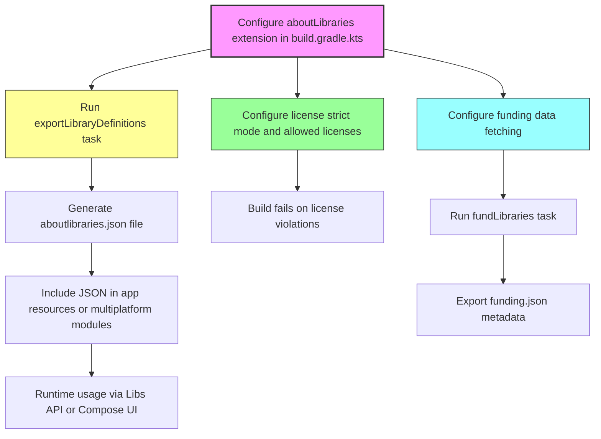

# Plugin Tasks & Configuration Extension

This reference documents the Gradle plugin extension DSL for AboutLibraries, detailing the configuration properties and primary tasks available. It guides you in customizing, automating, and querying the generation and export of library, license, and funding metadata directly within your build pipeline.

---

## Overview

AboutLibraries provides a powerful Gradle plugin that integrates into your build to collect detailed information about your project dependencies—including licenses and funding data—and export this metadata in consumable JSON formats. This page focuses specifically on:

- The `aboutLibraries` Gradle extension DSL for fine-tuning plugin behavior
- Configuration properties available to control data collection, export, license compliance, and duplication handling
- Primary Gradle tasks (`exportLibraryDefinitions`, `exportLibraries`, `fundLibraries`, and compliance exports) to automate metadata handling

Through this extension, you can precisely customize what data is collected, how it is exported, and enforce strict license compliance policies,
ensuring your build artifacts are compliant and fully documented for legal and transparency requirements.

## Gradle Plugin Extension DSL

The `aboutLibraries` extension provides a nested DSL in your `build.gradle.kts` or equivalent Gradle Kotlin scripts. Here is a structured breakdown of its main configuration blocks and properties:

### `collect { ... }`
This section controls how and what library metadata is collected.

| Property                 | Type       | Description                                                                                     | Default       |
|--------------------------|------------|-------------------------------------------------------------------------------------------------|---------------|
| `configPath`             | `File`     | Path to additional config files (e.g., JSON overrides for libraries, licenses, funding). Relative to module root. | -             |
| `gitHubApiToken`         | `String?`  | Optional GitHub API token to increase rate limits for fetching remote license and funding info. | null          |
| `offlineMode`            | `Boolean`  | If true, disables any remote network requests, making the build completely offline.             | `false`       |
| `fetchRemoteLicense`     | `Boolean`  | Enables fetching licenses remotely via supported hosts (e.g., GitHub API). Requires `gitHubApiToken`. | `false`       |
| `fetchRemoteFunding`     | `Boolean`  | Enables fetching project funding information remotely. Requires `gitHubApiToken`.               | `false`       |
| `filterVariants`         | `Set<String>` | Filters dependency collection to specified build variants (e.g., `debug`, `release`).             | empty set     |
| `includePlatform`        | `Boolean`  | Whether to include platform dependencies in the collected metadata.                             | `true`        |


### `export { ... }`
Controls the default export behavior for the collected metadata.

| Property                 | Type       | Description                                                                                     | Default       |
|--------------------------|------------|-------------------------------------------------------------------------------------------------|---------------|
| `outputFile`             | `File`     | File path where the exported JSON metadata is written.                                         | Required      |
| `variant`                | `String`   | Optional build variant to export (e.g., `release`).                                            | -             |
| `excludeFields`          | `Set<String>` | Fields to exclude from the generated JSON, either globally or scoped by class name (e.g., `License.name`). | empty set     |
| `prettyPrint`            | `Boolean`  | Enables pretty printing of the output JSON for readability.                                    | `false`       |

### `exports { ... }`
Supports defining multiple named export configurations, often per platform or build variant.

Example:

```kotlin
exports {
    create("desktop") {
        prettyPrint = true
        outputFile = file("src/desktopMain/composeResources/files/aboutlibraries.json")
    }
    create("wasmJs") {
        prettyPrint = true
        outputFile = file("src/wasmJsMain/composeResources/files/aboutlibraries.json")
    }
}
```

### `license { ... }`
Configure license strict mode and allowed license policies for compliance enforcement.

| Property                 | Type       | Description                                                                                | Notes                             |
|--------------------------|------------|--------------------------------------------------------------------------------------------|----------------------------------|
| `strictMode`             | `StrictMode` enum | Determines behavior on license violations: `FAIL`, `WARN`, or `OFF`.                  | Only `FAIL` fails the build.      |
| `allowedLicenses`        | `Set<String>` | Global whitelist of license IDs permitted in project dependencies without failure.       | License IDs like `Apache-2.0`, `MIT`|
| `allowedLicensesMap`     | `Map<String, List<String>>` | Per-license ID map specifying which library groups are allowed for said license.    | Enables fine-grained rules        |
| `additionalLicenses`     | `Set<String>` | License IDs for which full license text should be forcibly included in output even if unused. | Useful for ensuring completeness |

### `library { ... }`
Controls library-level handling.

| Property                 | Type       | Description                                                                                 |
|--------------------------|------------|---------------------------------------------------------------------------------------------|
| `duplicationMode`        | `DuplicateMode` enum | Controls how duplicate libraries are handled: `MERGE`, `LINK`, or `NONE`.               |
| `duplicationRule`        | `DuplicateRule` enum | Defines the matching strategy for determining duplicates (e.g., `SIMPLE`).                |

## Primary Gradle Tasks

The plugin registers a set of key tasks to generate and export metadata. These are essential to automate within your CI/CD pipeline or local development workflow.

| Task Name                     | Description                                                                                      |
|-------------------------------|------------------------------------------------------------------------------------------------|
| `exportLibraryDefinitions`    | Generates the `aboutlibraries.json` file containing all collected dependency and license metadata based on configured properties. This is the primary export task.
| `exportLibraries`             | Outputs a CSV or console format dependency list with basic name and version info, useful for simple audits.
| `exportComplianceLibraries`   | Generates reports useful for license compliance auditing (e.g., CSV or text outputs), typically includes detailed license info.
| `fundLibraries`               | Queries and exports funding information for included libraries, requiring GitHub API token.

### Running Export with Custom Output

You can override the output path and variant dynamically via command line:

```bash
./gradlew app:exportLibraryDefinitions \
  -PaboutLibraries.outputFile=src/main/resources/libraries.json \
  -PaboutLibraries.exportVariant=release
```

### Automating License Compliance

Enabling strict mode causes the build to fail when any dependency violates your licensed whitelist rules:

```kotlin
aboutLibraries {
    license {
        strictMode = StrictMode.FAIL
        allowedLicenses.addAll("Apache-2.0", "MIT")
        allowedLicensesMap = mapOf(
            "NOASSERTION" to listOf("org.jetbrains.kotlinx")
        )
    }
}
```

> For Android projects, strict mode enforces compliance automatically during builds when using the Android-specific plugin variant.
> For non-Android projects, you must manually invoke `exportLibraryDefinitions` to enforce.

## Example Configuration

```kotlin
aboutLibraries {
    collect {
        configPath = file("../config")
        gitHubApiToken = if (hasProperty("github.pat")) property("github.pat")?.toString() else null
        offlineMode = false
        fetchRemoteLicense = false
        fetchRemoteFunding = true
        filterVariants.addAll("debug", "release")
        includePlatform = true
    }

    export {
        outputFile = file("src/commonMain/composeResources/files/aboutlibraries.json")
        prettyPrint = true
        excludeFields.addAll("License.name", "developers")
    }

    exports {
        create("jvm") {
            outputFile = file("files/jvm/aboutlibraries.json")
        }
        create("wasmJs") {
            outputFile = file("files/wasmJs/aboutlibraries.json")
        }
    }

    license {
        strictMode = StrictMode.FAIL
        allowedLicenses.addAll("Apache-2.0", "MIT")
        allowedLicensesMap = mapOf(
            "NOASSERTION" to listOf("org.jetbrains.kotlinx")
        )
        additionalLicenses.addAll("mit", "mpl_2_0")
    }

    library {
        duplicationMode = DuplicateMode.LINK
        duplicationRule = DuplicateRule.SIMPLE
    }
}
```

## User Flow: From Configuration to Export

1. **Configure the plugin**: Customize collection and export settings in `aboutLibraries` extension.
2. **Run export task**: Execute `./gradlew exportLibraryDefinitions` to generate the JSON file.
3. **Use output**: Integrate the generated `aboutlibraries.json` in your app's resource directory or multiplatform resources.
4. **Enforce compliance**: Utilize strict license mode to prevent builds with disallowed licenses.
5. **Automate funding export**: Run `fundLibraries` to generate funding metadata for your dependencies.

This flow ensures that your dependency metadata is accurate, complete, and compliant, ready to power UI displays and audits.

---

## Tips and Best Practices

- **Always provide a GitHub API token** when enabling remote license or funding fetching to avoid rate-limiting errors.
- **Use `offlineMode` in CI environments** where network access might be restricted or to guarantee repeatable builds.
- **Define `configPath` carefully**, placing your custom library, license, and funding JSON files appropriately to augment or override automatic metadata.
- **Use `exports` for multi-platform projects** to generate platform-specific `aboutlibraries.json` files automatically.
- **Enable `prettyPrint` for easier inspection** of generated JSON when debugging or for manual reviews.
- **Configure `allowedLicenses` and `allowedLicensesMap` early** to avoid inadvertent license violations breaking your build.
- **Leverage `duplicationMode` and `duplicationRule`** to avoid redundant entries in your metadata caused by transitive dependencies.

## Troubleshooting Common Issues

<AccordionGroup title="Common Plugin Configuration Issues">
<Accordion title="Plugin Not Generating Metadata">
- Ensure the plugin is applied correctly in your module's `build.gradle.kts`.
- Confirm that you run `exportLibraryDefinitions` manually if not using the Android auto-registering plugin.
- Verify `outputFile` paths are valid and accessible.
</Accordion>
<Accordion title="License Strict Mode Failures">
- Check your allowed license lists and mappings.
- Use `findLibraries` task to list all licenses in use.
- Review the full build output for detailed license violation warnings.
</Accordion>
<Accordion title="GitHub API Rate Limit Errors">
- Confirm `gitHubApiToken` is set and valid.
- If no token is supplied, disable remote fetching.
- Rotate tokens periodically if using CI.
</Accordion>
<Accordion title="Duplicate Libraries in Output">
- Adjust `duplicationMode` (try `LINK` or `MERGE`).
- Tweak `duplicationRule` if needed.
- Verify if duplicates are caused by platform vs. implementation dependencies.
</Accordion>
</AccordionGroup>


---

## Related Documentation

- [Setup Guide: Plugin Configuration](../getting-started/configuration-and-first-run/plugin-configuration)
- [Generating Library Metadata](../getting-started/configuration-and-first-run/generate-metadata)
- [Migration Guide](../../changelog/breaking-changes-migration/migration-guides)
- [Gradle API / Tasks Overview](../../guides/best-practices-workarounds/advanced-gradle-examples)
- [Compliance Enforcement & License Strict Mode](../../guides/best-practices-workarounds/compliance-and-license-strict-mode)


---

## Code Links

See the core extension source code here for full API details and extension properties:

<Source url="https://github.com/mikepenz/AboutLibraries" paths={[{"path": "plugin-build/plugin/src/main/kotlin/com/mikepenz/aboutlibraries/plugin/AboutLibrariesExtension.kt", "range": "1-150"}]} />

---

## Summary Diagram: Plugin Usage Flow



This visual guides you from initial plugin configuration through data export and runtime integration.

---

*Documentation complete.*