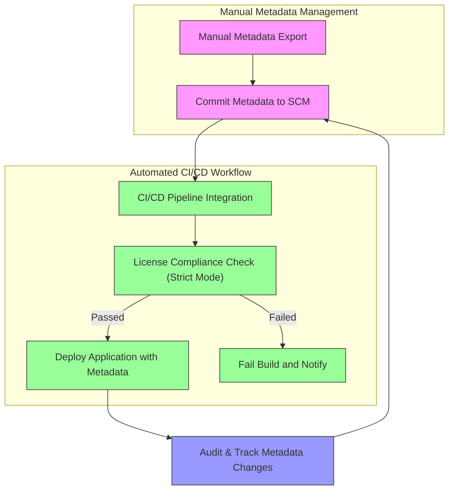

# CI, Enterprise, and Manual Metadata Handling

This advanced guide equips teams and organizations with precise control over the full lifecycle of AboutLibraries' dependency metadata. It focuses on manual metadata generation, strategies for integrating into source control management (SCM), and configuring continuous integration/continuous deployment (CI/CD) workflows to guarantee traceable, auditable, and reproducible delivery of the `aboutlibraries.json` asset.

---

## Workflow Overview

**Purpose:** This guide helps developers and technical leads establish robust processes to manually generate, version, and deploy AboutLibraries metadata, ensuring enterprise-grade compliance and traceability.

**Prerequisites:**
- Familiarity with Gradle plugin basics and AboutLibraries core concepts.
- Access and permissions to your CI/CD platform and SCM repository.
- A project with the AboutLibraries Gradle plugin configured for metadata export.

**Outcome:**
- Establish manual export of dependency metadata.
- Integrate export artifacts into SCM.
- Automate metadata validation and inclusion within CI/CD pipelines.
- Ensure metadata consistency, traceability, and audit readiness.

**Estimated Time:** 30-60 minutes to implement basic workflows; longer for CI/CD customization.

**Difficulty Level:** Intermediate to Advanced

---

## Step-by-Step Instructions

### 1. Configure Manual Metadata Export in Gradle

Ensure your `build.gradle.kts` or equivalent includes export configuration pointing to a dedicated output location:

```kotlin
aboutLibraries {
    export {
        prettyPrint = true
        outputFile = file("src/main/resources/aboutlibraries.json")
    }
}
```

- **Action:** Run the export task manually:
  ```bash
gradle exportLibraryDefinitions
```
- **Expected Result:** The `aboutlibraries.json` file is generated at the configured path with a well-formatted JSON listing all detected dependencies and their license data.

<Tip>
Keep the output location inside your source-controlled directory (e.g., `src/main/resources`) to enable versioning and distribution.
</Tip>

---

### 2. Commit Metadata to Source Control

- **Action:** Add the generated `aboutlibraries.json` to your SCM repository.
  ```bash
git add src/main/resources/aboutlibraries.json
git commit -m "Add initial AboutLibraries dependency metadata"
git push
```
- **Expected Result:** Metadata changes are tracked and auditable alongside your source code.

<Note>
Avoid committing metadata files in build output directories like `build/`. Place them in source-controlled folders for traceability.
</Note>

---

### 3. Integrate Metadata Generation into CI Pipelines

Automate metadata exports during your CI builds for continuous accuracy.

- **Action:** In your CI configuration (e.g., GitHub Actions, Jenkins, GitLab CI):
  - Include a Gradle step to run `exportLibraryDefinitions`.
  - Optionally verify or fail builds based on license strictness rules.

- **Sample GitHub Actions snippet:**
  ```yaml
  - name: Export AboutLibraries Metadata
    run: ./gradlew exportLibraryDefinitions

  - name: Commit and Push Metadata if Changed
    run: |
      git config user.name "CI Bot"
      git config user.email "ci@example.com"
      git add src/main/resources/aboutlibraries.json
      git diff --quiet || git commit -m "Update dependency metadata"
      git push || echo "No changes to push"
  ```

- **Expected Result:** CI runs consistent exports, updates tracked metadata, and flags license compliance issues automatically.

<Tip>
Use a dedicated CI-bot or service account for committing generated metadata to avoid author conflicts.
</Tip>

---

### 4. Establish Enterprise Approvals and Auditing

Consider policies where manual review or approval is required before metadata changes are merged:

- **Action:** Use pull request workflows for `aboutlibraries.json` modifications.
- **Action:** Add automated compliance checks using AboutLibraries license `strictMode` to enforce allowed licenses.
  ```kotlin
  aboutLibraries {
      license {
          strictMode = StrictMode.FAIL
          allowedLicenses.addAll("Apache-2.0", "MIT")
      }
  }
  ```
- **Expected Result:** Builds fail on disallowed or unknown licenses, preventing unauthorized dependency usage.

---

### 5. Manual Metadata Handling Best Practices

- **Keep Configuration Files Separate:** Store any override or custom configuration files outside generated outputs, e.g., in a `config/` directory.
- **Version Control:** Treat metadata files as first-class artifacts requiring versioning.
- **Offline Mode:** Use `offlineMode` when network access is restricted or to freeze metadata state.
  ```kotlin
  aboutLibraries {
      collect {
          offlineMode = true
      }
  }
  ```
- **Regular Updates:** Schedule periodic metadata exports as dependencies evolve.

<Warning>
Never manually edit the generated JSON file unless you fully understand the schema and implications. Always prefer overrides via supported configuration files.
</Warning>

---

## Practical Examples

### Example: Manual Export and Commit Workflow

```bash
# Run library metadata export
gradle exportLibraryDefinitions

# Verify the generated file
cat src/main/resources/aboutlibraries.json | jq . | less

# Commit and push changes
git add src/main/resources/aboutlibraries.json
git commit -m "Update dependency metadata"
git push
```

### Example: Minimal CI Pipeline Step (Jenkinsfile syntax)

```groovy
stage('Generate AboutLibraries Metadata') {
    steps {
        script {
            sh './gradlew exportLibraryDefinitions'
            sh 'git add src/main/resources/aboutlibraries.json'
            sh '''
               if [ -n "$(git status --porcelain)" ]; then
                 git commit -m "Update AboutLibraries metadata [ci skip]"
                 git push
               fi
            '''
        }
    }
}
```

---

## Troubleshooting & Tips

### Common Issues

- **Metadata Not Generated:** Check your Gradle plugin configuration and that the export task was run.
- **File Not Included in SCM:** Confirm that the `aboutlibraries.json` file is tracked in your VCS and not ignored by `.gitignore`.
- **Licenses Causing Build Failures:** Adjust `allowedLicenses` or override license info if false positives occur.
- **Network Requests Failing:** Enable `offlineMode` to disable remote license fetching, useful in CI environments.

### Tips for Success
- Validate your metadata JSON using JSON formatters or linters.
- Leverage AboutLibraries' strict license mode in CI to enforce compliance.
- Use incremental CI commits to keep metadata artifacts up to date without manual intervention.

---

## Next Steps & Related Resources

- Review [Generating Library Metadata](../../getting-started/configuration-and-first-run/generate-metadata) for foundational export setup.
- Explore [First App Integration and Usage](../../getting-started/configuration-and-first-run/first-app-integration) to learn how to consume the metadata.
- Consult [Common Installation and Build Errors](../../getting-started/troubleshooting/common-errors-fixes) for diagnosing integration problems.
- For UI customization, visit [Customizing Compose UI Integration](../../guides/advanced-integration/compose-customization).

---

## Visual Workflow Diagram



---