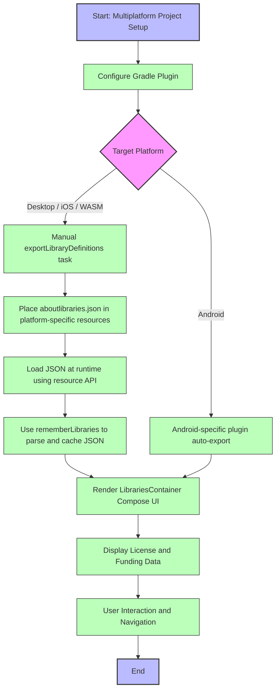

# Multiplatform and Non-Android Use Cases

This guide walks you through practical scenarios for integrating and using the AboutLibraries library beyond Android—specifically for Desktop (JVM), iOS, and WebAssembly (WASM) platforms. It covers how to manually export and load metadata, render the UI with Compose, and address platform-specific considerations when leveraging the Compose UI components in these environments.

---

## 1. Overview

### What This Guide Covers
- Exporting library metadata manually for non-Android platforms
- Loading the `aboutlibraries.json` file at runtime on Desktop, iOS, WASM
- Using Compose UI modules (`LibrariesContainer`) in non-Android Compose multiplatform environments
- Platform-specific tips and common challenges when using AboutLibraries beyond Android

### Prerequisites
- Have the AboutLibraries Gradle plugin configured in your project
- Familiarity with Kotlin Multiplatform and Jetpack Compose
- Basic knowledge of your target platform’s resource management

### Expected Outcome
- You will generate and include library metadata suitable for multiplatform targets
- You will render a fully working libraries screen using Compose UI on Desktop, iOS, or WASM

### Time Estimate
- 20-30 minutes for setup and initial integration

### Difficulty Level
- Intermediate

---

## 2. Exporting Library Metadata for Multiplatform

### Why Manual Export?
Unlike Android where the Android-specific plugin auto-generates metadata during build, multiplatform targets generally require explicit manual export of metadata JSON files.

### How to Export Metadata

Use the Gradle task `exportLibraryDefinitions` with custom output file location and variant.

```bash
# Export for Desktop JVM target
./gradlew :app-desktop:exportLibraryDefinitions -PaboutLibraries.outputFile=src/main/resources/libraries.json

# Export for WASM JavaScript target
./gradlew :app-wasm:exportLibraryDefinitions -PaboutLibraries.outputFile=src/jsMain/resources/aboutlibraries.json -PaboutLibraries.exportVariant=wasmJs
```

### Best Practices
- Commit the generated `aboutlibraries.json` into your source control.
- Place the file inside the resource directory of your target platform for ease of loading.
- Maintain separate JSON files per target variant if you have variant-specific dependencies.

---

## 3. Loading Metadata at Runtime in Multiplatform Compose

### General Approach
On multiplatform targets, AboutLibraries does not provide automatic resource loading. You must manually read the JSON file and supply it to the Compose UI.

### Examples by Platform

#### Desktop (JVM)
Use standard resource loading APIs to read the JSON file from your JVM resources.

```kotlin
val libraries by rememberLibraries {
    Res.readBytes("files/aboutlibraries.json").decodeToString()
}
LibrariesContainer(libraries, Modifier.fillMaxSize())
```

*Example from Desktop sample app source*.

#### iOS
Use the Compose UIViewController to render the libraries screen, loading the JSON resource similarly.

```kotlin
val libraries by rememberLibraries {
    Res.readBytes("files/aboutlibraries.json").decodeToString()
}
LibrariesContainer(libraries, Modifier.fillMaxSize())
```

This example matches usage in the [MainViewController.kt](app/src/iosMain/kotlin/com/mikepenz/aboutlibraries/sample/MainViewController.kt).

#### WASM
Load resources via the compose-resources API and provide to Compose UI.

```kotlin
val libraries by rememberLibraries {
    Res.readBytes("files/aboutlibraries.json").decodeToString()
}
LibrariesContainer(libraries, Modifier.fillMaxSize())
```

Available in the WASM sample main function.

---

## 4. Rendering the Libraries UI

Use the `LibrariesContainer` composable from the AboutLibraries Compose UI module. This component displays the open source libraries and license information with minimal configuration.

### Basic Usage

```kotlin
LibrariesContainer(
    libraries, // JSON string or Libs object
    modifier = Modifier.fillMaxSize()
)
```

### Notes
- Pass the JSON string after loading it from your platform-specific resources.
- Use `rememberLibraries` to load and parse the JSON with caching.
- Customize the UI by overriding header, footer, divider, or color parameters as needed (see Compose customization guide).

---

## 5. Platform-Specific Considerations

### Resource File Placement
- **Desktop JVM:** Place `aboutlibraries.json` in `src/main/resources` or equivalent.
- **iOS:** Include JSON in `iosMain/resources` folder, access via resource APIs.
- **WASM:** Put JSON in `jsMain/resources` folder, accessed as a resource at runtime.

### Gradle Plugin Setup
- On non-Android targets, ensure to NOT apply the Android-specific plugin variant.
- The main Gradle Plugin (`com.mikepenz.aboutlibraries.plugin`) supports manual export and multiplatform.

### Variant Management
- Use the `exportVariant` property to export metadata matching your build variant (e.g., `release`, `wasmJs`).
- Configure outputs per variant if you have complex multiplatform builds.

### Dependency Management
- All dependency and license detection happens at build time.
- For platform-specific dependencies or native libraries, manual adjustments in the configuration JSON might be needed.

---

## 6. Troubleshooting & Tips

### Common Issues

- **Metadata Not Found or Empty UI**
  - Verify the JSON file was generated and placed correctly in resources.
  - Confirm your resource loading code is correctly reading the file as a UTF-8 string.

- **Version/License Data Not Showing Correctly**
  - Check that you are exporting the proper variant.
  - Ensure that variant filtering in the Gradle plugin isn't excluding dependencies.

- **UI Does Not Render or Crashes**
  - Confirm Compose Multiplatform dependencies versions are compatible.
  - Validate your Compose UI module inclusion.

### Best Practices

- Always cache loaded library JSON using `rememberLibraries` to avoid repeated parsing.
- Use Gradle export tasks inside CI pipelines to produce deterministic metadata.
- Review and update your metadata manually if native dependencies are missing.

### Performance Considerations
- JSON files are lightweight, but large dependency graphs may impact UI rendering.
- Minimize unnecessary recompositions by leveraging Compose's state management.

---

## 7. Next Steps & Related Guides

- **Setup the Gradle Plugin:** [Setting Up the Gradle Plugin](/guides/getting-started/setup-gradle-plugin)
- **Generating Metadata:** [Exporting Dependency Metadata](/guides/getting-started/exporting-metadata)
- **Multiplatform Compose Customization:** [Customizing Compose UI Integration](/guides/advanced-integration/compose-customization)
- **First App Integration:** [First App Integration and Usage](/getting-started/configuration-and-first-run/first-app-integration)
- **Troubleshooting:** [Common Installation and Build Errors](/getting-started/troubleshooting/common-errors-fixes)

---

## Appendix: Example Multiplatform Desktop Main Function

```kotlin
import aboutlibraries.app.generated.resources.Res
import androidx.compose.foundation.layout.fillMaxSize
import androidx.compose.material.Scaffold
import androidx.compose.material.Text
import androidx.compose.material.TopAppBar
import androidx.compose.runtime.getValue
import androidx.compose.ui.Modifier
import androidx.compose.ui.window.ComposeViewport
import com.mikepenz.aboutlibraries.ui.compose.LibrariesContainer
import com.mikepenz.aboutlibraries.ui.compose.rememberLibraries

fun main() {
    ComposeViewport {
        SampleTheme {
            Scaffold(
                topBar = { TopAppBar(title = { Text("AboutLibraries Compose Desktop Sample") }) }
            ) {
                val libraries by rememberLibraries {
                    Res.readBytes("files/aboutlibraries.json").decodeToString()
                }
                LibrariesContainer(
                    libraries,
                    Modifier.fillMaxSize(),
                )
            }
        }
    }
}
```

*This functional snippet highlights Compose UI usage loading runtime metadata for desktop JVM apps.*


---

<Check>
To ensure a smooth multiplatform experience with AboutLibraries:

- Confirm metadata export runs successfully with the Gradle plugin.
- Include the JSON files properly in your target platform resources.
- Use `rememberLibraries {}` with resource loading lambda to cache parsed data.
- Render UI with `LibrariesContainer` composable leveraging common Compose APIs.
- Tailor resource output paths and variants as per your flavor or platform.
</Check>


---

## References

- [AboutLibraries Gradle Plugin Configuration](https://github.com/mikepenz/AboutLibraries#gradle-plugin)
- [Compose Multiplatform Integration](https://github.com/mikepenz/AboutLibraries#compose-multiplatform-desktop-wasm-ios)
- [Generating Library Metadata](https://github.com/mikepenz/AboutLibraries#exporting-dependency-metadata)


---

# Mermaid Diagram: Workflow for Multiplatform Use



---