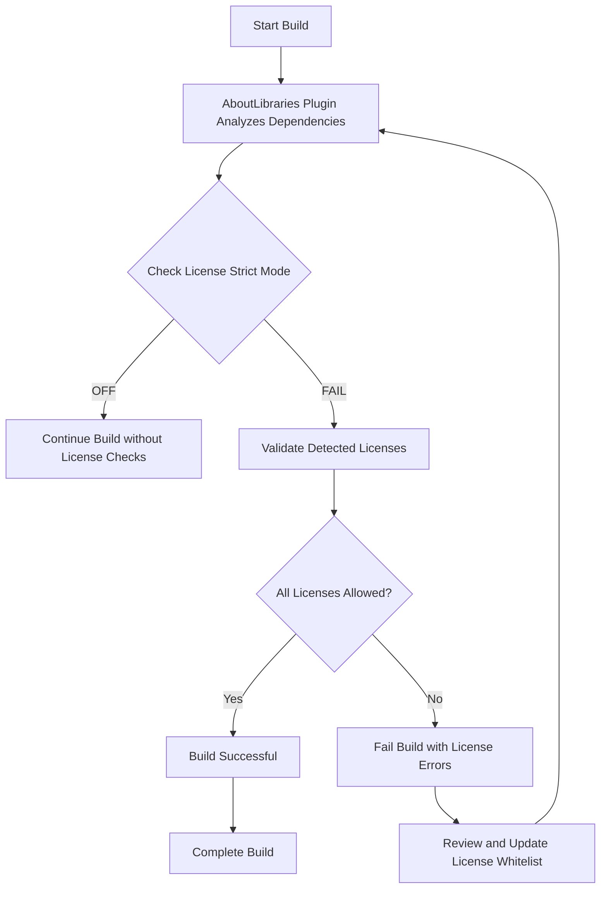

# Compliance and License Strict Mode

This guide details how to configure and use AboutLibraries' **license strict mode** to enforce license compliance policies during build time. It helps you whitelist approved licenses, automatically fail builds that include unapproved or disallowed licenses, and maintain compliance in regulated or audited environments.

---

## 1. Understanding License Strict Mode

When embedding third-party libraries in your project, maintaining compliance with licensing requirements is critical. The **License Strict Mode** feature of AboutLibraries ensures that only dependencies with licenses you explicitly approve are allowed.

This prevents unintentional distribution of software with incompatible or non-approved licenses, which is critical in enterprise, regulated, or audited contexts.

### Key Benefits
- **Automatic Build Failures:** Blocks builds if unapproved licenses are detected.
- **Whitelisting:** Specify precisely which licenses are permitted globally or for specific libraries.
- **Early Compliance Feedback:** Detect license conflicts during your CI/CD rather than post-release.

---

## 2. Prerequisites

Before configuring strict mode, ensure:

- You have AboutLibraries Gradle plugin applied to your project (`com.mikepenz.aboutlibraries.plugin` or `com.mikepenz.aboutlibraries.plugin.android`).
- Your project successfully generates the license metadata (`aboutlibraries.json`).
- You understand your organization's license policy and have a list of allowed licenses ready.

---

## 3. Configuring License Strict Mode

### 3.1 Enable Strict Mode

In your `build.gradle.kts` (or equivalent), locate or create the `aboutLibraries` configuration block. Enable strict mode by setting:

```kotlin
aboutLibraries {
    license {
        // Fail the build if unapproved licenses are found
        strictMode = com.mikepenz.aboutlibraries.plugin.StrictMode.FAIL

        // Define licenses globally allowed in the project (using SPDX IDs or custom IDs)
        allowedLicenses.addAll("Apache-2.0", "MIT")

        // Optionally, define allowed licenses for specific libraries by their unique Id
        allowedLicensesMap = mapOf(
            "com.somelib:somedependency" to listOf("Apache-2.0"),
            "NOASSERTION" to listOf("org.jetbrains.kotlinx")
        )

        // Add additional full license content for embedded inclusion, if needed
        // additionalLicenses.addAll("mit", "mpl_2_0")
    }
}
```

### Explanation:
- **strictMode:** `FAIL` makes the build fail on license violations.
- **allowedLicenses:** The global whitelist of license IDs allowed without failing.
- **allowedLicensesMap:** Override or add licenses allowed specifically for certain dependencies.


### 3.2 Disable Strict Mode (Optional)

If you want to skip strict checking temporarily (e.g., during early development), set:

```kotlin
strictMode = com.mikepenz.aboutlibraries.plugin.StrictMode.OFF
```

This disables build failure and lets you receive warning or no feedback.

---

## 4. How Strict Mode Works in Your Build

1. The plugin scans all dependencies during the build.
2. It collects licenses metadata for each dependency.
3. The plugin compares found licenses against `allowedLicenses` and `allowedLicensesMap`.
4. If any dependency's license is not present in these whitelists, the build will fail.
5. For Android projects, this happens automatically during assembly tasks if you use the Android plugin variant.
6. For non-Android projects, run the `exportLibraryDefinitions` manually to trigger checks.

---

## 5. Managing Allowed Licenses

### 5.1 Specifying SPDX License IDs

Use their standard SPDX identifiers (such as `Apache-2.0`, `MIT`, `BSD-3-Clause`). These should match the license IDs declared in the metadata.

### 5.2 Handling Unknown or Custom Licenses

You can whitelist custom or unknown licenses per library by specifying their unique `allowedLicensesMap` keys.

Example:

```kotlin
allowedLicensesMap = mapOf(
    "NOASSERTION" to listOf("org.jetbrains.kotlinx"),
    "custom-license-id" to listOf("my.custom.library")
)
```

### 5.3 Adding Additional License Texts

Including full license texts for some licenses can be done via `additionalLicenses`.

```kotlin
license {
    additionalLicenses.addAll("mit", "mpl_2_0")
}
```

This ensures their license text is included in generated metadata.

---

## 6. Troubleshooting Common Issues

<AccordionGroup title="Common License Strict Mode Issues">
<Accordion title="Build Fails Unexpectedly with License Violations">
Verify your license whitelist contains all licenses used by your dependencies, including transitive ones. Use the Gradle task `findLibraries` to list all dependencies and their licenses.
</Accordion>
<Accordion title="Certain Licenses Are Not Recognized or Matched">
Check for correct SPDX IDs or that your dependencies properly declare their licenses. You can add overrides in the `configPath` to fix metadata.
</Accordion>
<Accordion title="Allowing Specific Dependencies with Different Licenses">
Use the `allowedLicensesMap` to whitelist licenses per dependency instead of globally.
</Accordion>
</AccordionGroup>

### Troubleshooting Tips
- Run `./gradlew findLibraries` to list all detected dependencies and license IDs.
- Review the generated `aboutlibraries.json` for accurate license info.
- Consult your legal or compliance team if unsure about a license.

---

## 7. Advanced Compliance Best Practices

- **Use CI Integration:** Configure your CI pipeline to run build with strict mode enabled to catch violations early.
- **Combine with Manual Overrides:** Use JSON files in `configPath` to override or add license data for dependencies with incomplete info.
- **Version Control License Metadata:** Commit generated metadata to SCM to ensure consistent builds.
- **Review License Updates Regularly:** Update allowed licenses when dependencies change or new versions arrive.

---

## 8. Summary Diagram



---

## 9. Next Steps

- **Configure and generate your metadata:** See [Generating Library Metadata](/getting-started/configuration-and-first-run/generate-metadata).
- **Integrate into your app:** Visualize licenses with the Compose UI module ([First App Integration](/getting-started/configuration-and-first-run/first-app-integration)).
- **Customize license and funding info:** Learn how to modify metadata in [Modifying Library, License, and Funding Information](/guides/advanced-integration/modifying-library-license-info).
- **Troubleshoot builds:** See [Troubleshooting Common Scenarios](/guides/best-practices-workarounds/troubleshooting-common-scenarios).

---

## 10. References

- [Gradle Plugin Configuration Options](https://github.com/mikepenz/AboutLibraries#gradle-plugin-configuration)
- [AboutLibraries Plugin Extension Configuration `aboutLibraries`](https://github.com/mikepenz/AboutLibraries/blob/develop/plugin-build/plugin/src/main/kotlin/com/mikepenz/aboutlibraries/plugin/AboutLibrariesExtension.kt)
- [License Strict Mode Enum `StrictMode`](https://github.com/mikepenz/AboutLibraries/blob/develop/plugin-api/src/main/kotlin/com/mikepenz/aboutlibraries/plugin/StrictMode.kt)

---

<Note>
Always review your allowed licenses carefully, as legal compliance requires exact license matching and understanding. When using strict mode failures, review the build logs for detailed license violation reports.
</Note>

<Check>
To validate your configuration, run `./gradlew clean build` and verify no license strict mode failures occur.
</Check>
