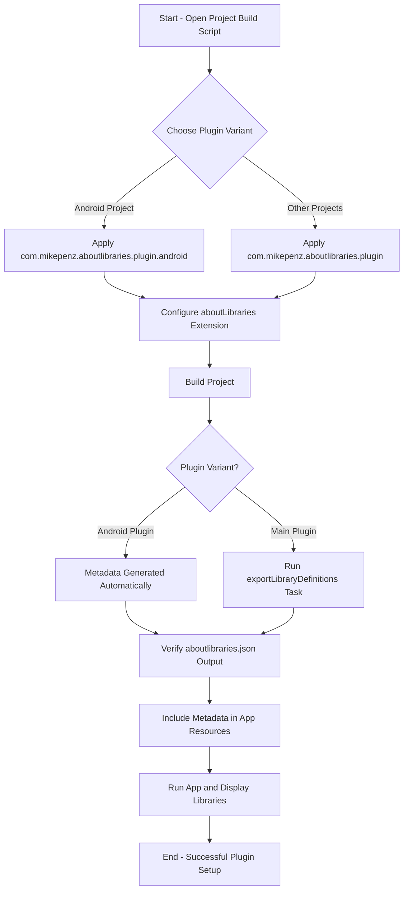

# Setting Up the Gradle Plugin

Learn how to configure and enable the AboutLibraries Gradle Plugin in your project for automatic generation of dependency and license metadata. This guide covers both the main plugin and the Android-specific plugin variants, highlights key configuration options, and ensures your project is prepared to export the metadata used by AboutLibraries at runtime.

---

## Workflow Overview

**What this guide helps you accomplish:**
- Integrate the AboutLibraries Gradle Plugin into your project
- Configure essential plugin settings for metadata generation
- Differentiate between main plugin and Android-specific plugin usage
- Prepare your build for automatic or manual export of dependency and license information

**Prerequisites:**
- Familiarity with Gradle Kotlin DSL (`build.gradle.kts`)
- Access to your project’s Gradle build files
- Latest stable AboutLibraries version number (e.g., from [Maven Central](https://search.maven.org/artifact/com.mikepenz/aboutlibraries-core))
- Understanding of your project type (Android, Multiplatform, Desktop, etc.)

**Expected Outcome:**
- Properly configured Gradle Plugin(s) for generating library metadata
- Smooth integration into your build process allowing AboutLibraries to collect dependency and license info

**Time Estimate:** 10-20 minutes

**Difficulty Level:** Beginner to Intermediate

---

## Step-by-Step Instructions

### 1. Choose the Appropriate Plugin Variant

- **Main Gradle Plugin (`com.mikepenz.aboutlibraries.plugin`)**
  - Recommended for most projects
  - Provides manual Gradle tasks like `exportLibraryDefinitions` to generate metadata
  - No automatic build process integration; you trigger tasks when needed

- **Android-specific Plugin (`com.mikepenz.aboutlibraries.plugin.android`)**
  - For Android projects needing automatic generation as part of the Android build
  - Automatically hooks into build lifecycle
  - Simplifies setup by removing manual task execution

<Check>
Select only one of these plugins based on your project requirements. Do not apply both simultaneously in the same module.
</Check>

### 2. Apply the Plugin in Your Build Script

Add the plugin in your module's `build.gradle.kts`:

```kotlin
// For Main Plugin (common use-case)
plugins {
    id("com.mikepenz.aboutlibraries.plugin") version "<latest-version>"
}

// For Android Plugin (Android-specific auto generation)
plugins {
    id("com.mikepenz.aboutlibraries.plugin.android") version "<latest-version>"
}
```

Replace `<latest-version>` with the latest AboutLibraries plugin version number.

<Tip>
Using the plugins DSL is the recommended, modern way to apply the plugin.
</Tip>

### 3. Configure the Plugin via the `aboutLibraries` Extension

Add a dedicated configuration block in the module's `build.gradle.kts` for fine-tuning:

```kotlin
aboutLibraries {
    collect {
        // Path for any additional config files (libraries, licenses, funding)
        configPath = file("../config")

        // Enable/disable remote license fetching (requires GitHub token)
        fetchRemoteLicense = false

        // Enable/disable remote funding info fetching
        fetchRemoteFunding = false

        // Optionally, specify which build variants to consider
        // filterVariants.addAll("debug", "release")

        // Optionally, enable offline mode to avoid network calls
        offlineMode = false
    }

    export {
        // Output file location for the generated JSON metadata
        outputFile = file("src/commonMain/composeResources/files/aboutlibraries.json")

        // Enable pretty print JSON formatting
        prettyPrint = true

        // Optionally, specify exact variant (e.g., release)
        // variant = "release"
    }

    // For multiplatform projects, define export files per variant
    exports {
        create("jvm") {
            outputFile = file("files/jvm/aboutlibraries.json")
        }
        create("wasmJs") {
            outputFile = file("files/wasmJs/aboutlibraries.json")
        }
    }

    license {
        // Enforce strict license checking (FAIL, WARN, or FREE)
        strictMode = com.mikepenz.aboutlibraries.plugin.StrictMode.FAIL

        // Declare allowed licenses to avoid build failures
        allowedLicenses.addAll("Apache-2.0", "MIT")

        // Map exceptions for specific libraries
        allowedLicensesMap = mapOf(
            "NOASSERTION" to listOf("org.jetbrains.kotlinx")
        )
    }

    library {
        // Enable merging or linking of duplicate dependencies
        duplicationMode = com.mikepenz.aboutlibraries.plugin.DuplicateMode.LINK

        // Select duplication matching strategy
        duplicationRule = com.mikepenz.aboutlibraries.plugin.DuplicateRule.SIMPLE
    }
}
```

<Note>
Adjust `configPath` relative to your module root. Do NOT use parent folders of modules as config paths to prevent issues.
</Note>

### 4. Generate Metadata

**For Main Plugin users:** run the metadata export manually:

```bash
./gradlew :<module_name>:exportLibraryDefinitions
```

Optionally specify output file and variant:

```bash
./gradlew :<module_name>:exportLibraryDefinitions -PaboutLibraries.outputFile=src/main/res/raw/aboutlibraries.json -PaboutLibraries.exportVariant=release
```

**For Android Plugin users:** no manual execution is needed; metadata is generated automatically during the Android build lifecycle.

<Check>
Verify the generated `aboutlibraries.json` exists at the configured location after build.
</Check>

### 5. Include the Generated Metadata in Your Application

- For Android projects using the Android plugin, the file is automatically included as a resource.
- For multiplatform or desktop projects, ensure your app reads the generated JSON manually or via provided APIs.

See [First App Integration and Usage](../configuration-and-first-run/first-app-integration) for detailed instructions.

---

## Practical Tips & Best Practices

- **Use Version Catalogs:** Manage plugin and library versions centrally for consistency.
- **Keep Plugin Versions Updated:** To leverage latest fixes and features.
- **Configure License StrictMode Carefully:** Start with WARN or FREE before enforcing FAIL to prevent build breaks during onboarding.
- **Fetch Remote Info Judiciously:** Use `fetchRemoteLicense` and `fetchRemoteFunding` only if you have a valid GitHub token.
- **Avoid Large Config Paths:** Point directly to config folders, never module parent directories.
- **Separate Plugin Usage:** Do not mix `com.mikepenz.aboutlibraries.plugin` and `com.mikepenz.aboutlibraries.plugin.android` in the same module.

---

## Common Pitfalls & Troubleshooting

<AccordionGroup title="Common Gradle Plugin Setup Issues">
<Accordion title="Plugin Not Found or Version Mismatch">
- Ensure you declared the plugin with the correct version in your `plugins` block.
- Check for compatibility with your Gradle and Kotlin versions.
- Use the Gradle Plugin Portal as a repository.
</Accordion>
<Accordion title="Metadata JSON Not Generated">
- Confirm you are running the `exportLibraryDefinitions` task if using the main plugin.
- If using the Android plugin, check your build outputs and resource folders.
- Validate `outputFile` path in your configuration is correct.
</Accordion>
<Accordion title="License Strict Mode Causes Build Fail">
- Review allowed licenses in your configuration.
- Add missing or needed licenses to `allowedLicenses` or `allowedLicensesMap`.
- Consider setting strict mode to WARN during initial setup.
</Accordion>
<Accordion title="Duplicate Library Entries or Conflicts">
- Use duplicationMode `LINK` and duplicationRule `SIMPLE` to merge duplicates.
- Verify dependencies in your Gradle files for conflicts.
- Run Gradle dependency insight tasks to diagnose dependency trees.
</Accordion>
</AccordionGroup>

---

## Next Steps & Related Content

- **Generate Metadata Guide:** Learn how to trigger metadata creation across platforms ([Generating Library Metadata](../configuration-and-first-run/generate-metadata)).
- **First App Integration:** Display your libraries with Compose UI and core APIs ([First App Integration and Usage](../configuration-and-first-run/first-app-integration)).
- **Plugin Configuration:** Deep dive on all available plugin settings ([Plugin Configuration](../configuration-and-first-run/plugin-configuration)).
- **Troubleshooting:** Solve common issues related to installation and build ([Common Installation and Build Errors](../../getting-started/troubleshooting/common-errors-fixes)).

---

## Additional Resources

- [AboutLibraries GitHub Repository](https://github.com/mikepenz/AboutLibraries)
- [Gradle Plugin Portal Listing](https://plugins.gradle.org/plugin/com.mikepenz.aboutlibraries.plugin)
- [Migration Guide](../../changelog/breaking-changes-migration/migration-guides)

---

Congratulations! Your project is now ready to leverage AboutLibraries' automated Gradle plugin for comprehensive dependency and license metadata management.

---

## Example Minimal Configuration

```kotlin
plugins {
    id("com.mikepenz.aboutlibraries.plugin") version "13.0.0-b01"
}

aboutLibraries {
    collect {
        configPath = file("../config")
        fetchRemoteLicense = false
        fetchRemoteFunding = false
        offlineMode = false
    }
    export {
        outputFile = file("src/commonMain/composeResources/files/aboutlibraries.json")
        prettyPrint = true
    }
    license {
        strictMode = com.mikepenz.aboutlibraries.plugin.StrictMode.FAIL
        allowedLicenses.addAll("Apache-2.0", "MIT")
    }
}
```

This setup enables you to generate metadata manually and integrate AboutLibraries cleanly.

---

## Summary Diagram of Setup Flow


