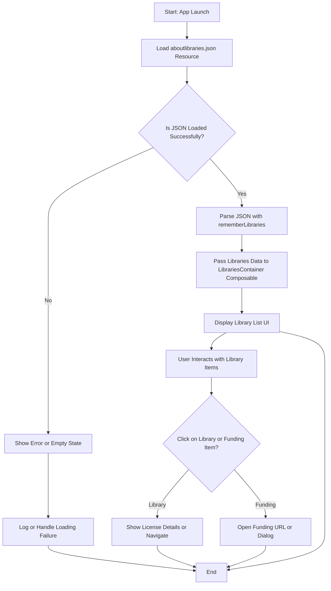

# Visualizing Libraries in Your App

This guide walks you through displaying collected library and license information in your app by leveraging the AboutLibraries Compose UI modules or the legacy view components. It covers loading metadata, using ready-to-go UI containers, and integrating them into your Compose screens or activities with concrete examples for multiplatform Compose setups.

---

## 1. Overview of Visualizing Libraries

**What You Will Achieve:**
- Load and display third-party library and license metadata dynamically in your app.
- Use the AboutLibraries compose UI modules (`LibrariesContainer`) for quick integration.
- Customize library listing appearance and behavior with provided parameters.
- Support multiplatform targets: Android, Desktop, iOS, and WASM Compose.

**Prerequisites:**
- Have an up-to-date `aboutlibraries.json` metadata file generated by the AboutLibraries Gradle plugin.
- Include the correct AboutLibraries Compose UI dependency matching your Material version:
  - For Material 3: `aboutlibraries-compose-m3`
  - For Material 2 or Compose Core: `aboutlibraries-compose`
- Basic familiarity with Jetpack Compose or Compose Multiplatform.

**Expected Outcome:**
- Your app displays a polished list of all detected library attributions, including license info, with optional UI customizations.

**Estimated Time:** 10-20 minutes for basic integration

**Difficulty Level:** Beginner to Intermediate

---

## 2. How Library Visualization Works

The AboutLibraries system automatically detects project dependencies and compiles their metadata into a JSON file (`aboutlibraries.json`). The Compose UI modules provide composable functions like `LibrariesContainer` to consume this data and render it into an interactive, scrollable list.

**Key Points:**
- `LibrariesContainer` is the central Composable that takes pre-loaded `Libs` data or a JSON string.
- `rememberLibraries` is a helper composable that parses your JSON metadata and returns `Libs` to pass into `LibrariesContainer`.
- UI appearance (colors, layout, info visibility) can be tailored through parameters.

---

## 3. Step-by-Step Integration Guide

### Step 1: Add the Compose UI Dependency

Choose the dependency matching your Material Design version:

```kotlin
// For Material 3 Compose UI
implementation("com.mikepenz:aboutlibraries-compose-m3:latest_version")

// For Material 2 or Core Compose UI
implementation("com.mikepenz:aboutlibraries-compose:latest_version")
```

### Step 2: Place your `aboutlibraries.json` in the correct resource folder

Depending on your target platform, place `aboutlibraries.json` in the correct folder to load it at runtime:
- Android: `src/main/assets`
- Desktop: resource directory or pack as resource
- iOS and WASM: as a resource accessible via Compose Multiplatform resource API

### Step 3: Load the Metadata with `rememberLibraries`

Use the `rememberLibraries` composable to read and parse your JSON metadata at runtime. Example for multiplatform Compose Desktop or iOS:

```kotlin
val libraries by rememberLibraries {
    Res.readBytes("files/aboutlibraries.json").decodeToString()
}
```

For Android, you can load via assets similarly.

### Step 4: Display With `LibrariesContainer`

Pass the loaded libraries into `LibrariesContainer` composable to visualize them:

```kotlin
LibrariesContainer(
    libraries = libraries,
    modifier = Modifier.fillMaxSize()
)
```

This will render a scrolling list of libraries with license and version info.

### Step 5: Customize the Display

You can adjust the information shown and UI styling through parameters:

- `showAuthor = true` (default) - Show author names
- `showDescription = false` - Show descriptions if desired
- `showVersion = true` - Display version numbers
- `showLicenseBadges = true` - Show license badges/icons
- `showFundingBadges = false` - Display funding badges

Example with customized header and footer:

```kotlin
LibrariesContainer(
    libraries = libraries,
    header = {
        item {
            Text("Open Source Libraries in This App", modifier = Modifier.padding(16.dp))
        }
    },
    footer = {
        item {
            Text("Thank you to all open source contributors!", modifier = Modifier.padding(16.dp))
        }
    }
)
```

### Step 6: Handle User Interactions

`LibrariesContainer` supports callbacks for library or funding item clicks:

```kotlin
LibrariesContainer(
    libraries = libraries,
    onLibraryClick = { library -> 
        // Trigger license dialog or navigate to license details
    },
    onFundingClick = { funding -> 
        // Open funding URL or show additional info
    }
)
```

These callbacks allow you to control navigation or display deeper detail screens.

---

## 4. Practical Example for Compose Desktop (Material 3)

```kotlin
@OptIn(ExperimentalMaterial3Api::class, ExperimentalResourceApi::class)
fun main() = application {
    Window(title = "AboutLibraries M3 Sample", onCloseRequest = ::exitApplication) {
        AppTheme {
            Scaffold(
                topBar = { TopAppBar(title = { Text("AboutLibraries Compose M3 Desktop Sample") }) }
            ) {
                val libraries by rememberLibraries {
                    Res.readBytes("files/aboutlibraries.json").decodeToString()
                }
                LibrariesContainer(
                    libraries = libraries,
                    modifier = Modifier.fillMaxSize().padding(it),
                    showFundingBadges = false,
                    header = {
                        item {
                            Text("Libraries Used", Modifier.padding(16.dp))
                        }
                    },
                    footer = {
                        item {
                            Text("Powered by AboutLibraries", Modifier.padding(16.dp))
                        }
                    }
                )
            }
        }
    }
}
```

---

## 5. Using Legacy View-Based Components (Deprecated)

If your app still uses classic Android views (not Compose), you can use legacy components from the AboutLibraries library, such as `LibrariesActivity` or `LibrariesFragment`. These automatically load and display library info but are less flexible and do not support multiplatform targets.

Example:

```kotlin
val intent = Intent(this, LibrariesActivity::class.java)
startActivity(intent)
```

**Warning:** This legacy mode is deprecated and not recommended for new projects.

---

## 6. Common Pitfalls and Troubleshooting

<AccordionGroup title="Troubleshooting Common Visual Issues">
<Accordion title="Empty or Missing Library List">
- Ensure `aboutlibraries.json` is correctly placed in assets/resources.
- Check your JSON is valid and up to date.
- Confirm `rememberLibraries` correctly loads the JSON with no silent errors.
</Accordion>
<Accordion title="UI Does Not Match Expectations">
- Verify you are using the matching `aboutlibraries-compose` dependency version for your Material Design version.
- Customize `LibrariesContainer` parameters appropriately.
- Check for conflicting Compose theming or modifiers.
</Accordion>
<Accordion title="Application Crashes on Start">
- Confirm the Gradle plugin generated `aboutlibraries.json` properly.
- Check your Compose runtime compatibility.
- Review logcat or runtime logs for detailed error messages.
</Accordion>
</AccordionGroup>

<Tip>
Consistently regenerate your `aboutlibraries.json` during your build process to keep library data up to date and prevent runtime mismatches.
</Tip>

---

## 7. Best Practices

- Use the `rememberLibraries` helper composable to efficiently cache and parse your metadata.
- Customize visible fields to fit your app's user experience and legal requirements.
- Add meaningful headers and footers to contextualize the attribution list.
- Handle user clicks to show license dialogs or external URLs gracefully.
- Prefer Material 3 Compose UI modules for the most modern, themeable experience.

---

## 8. Next Steps & Additional Resources

- Explore **Customizing Compose UI Integration** to tailor appearance and behavior: `/guides/advanced-integration/compose-customization`
- Learn about **Multiplatform and Non-Android Use Cases** for wider reach: `/guides/advanced-integration/multiplatform-use-cases`
- For details on generating and managing metadata, see: `/getting-started/configuration-and-first-run/generate-metadata`
- Consult the **First App Integration and Usage** guide for stepwise onboarding: `/getting-started/configuration-and-first-run/first-app-integration`
- For troubleshooting, the **Common Installation and Build Errors** page is invaluable: `/getting-started/troubleshooting/common-errors-fixes`

---

## 9. Related API Reference Pages

- [`LibrariesContainer` Compose API](https://your-docs-link/api-reference/compose-api/compose-librariescontainer-api)
- [`rememberLibraries` Data Loading](https://your-docs-link/api-reference/compose-api/rememberlibraries-data-loading)
- Legacy View-based API (deprecated): `/api-reference/legacy-view-api/legacy-activity-fragment-items`

---

## Appendix: Illustrated Workflow Diagram



This workflow encapsulates the practical steps from app start through displaying the libraries and responding to user interactions.
