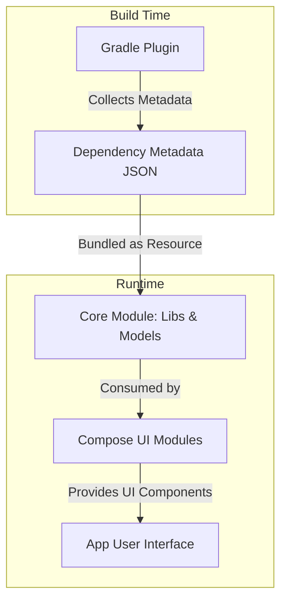

# Key Components & Data Flow

Understanding how AboutLibraries works under the hood empowers you to seamlessly incorporate library and license attribution into your applications with confidence and efficiency. This section demystifies the core components of AboutLibraries—from build-time metadata generation via the Gradle plugin to the runtime UI modules that display collected information—and walks you through the typical developer workflow from initial configuration through UI integration.

---

## Overview

At its core, AboutLibraries automates the discovery, collection, and display of third-party dependency metadata, helping you meet legal compliance and transparency requirements effortlessly. The system divides responsibility among several key components:

- **Gradle Plugin:** Scans your project during build time to collect detailed metadata about all declared dependencies including licenses and funding information.

- **Core Module:** Provides foundational data models such as `Libs`, `Library`, `License`, and related entities that represent the collected metadata in a structured way.

- **Compose UI Modules:** Supplies reusable UI components implemented via Jetpack Compose for displaying library and license information elegantly on Android and other Compose-supported platforms.

By clearly separating concerns, AboutLibraries achieves both powerful automation and flexible, customizable UI rendering.

---

## Components Breakdown

### 1. Gradle Plugin (Data Generation)

The AboutLibraries Gradle plugin activates during your build process to scan your declared dependencies. It collects rich metadata including:

- Library names, versions, and authors
- License types and full license texts
- Funding links and URLs

This metadata is serialized to JSON files bundled with your app’s resources, eliminating runtime overhead and network dependency. The plugin offers configuration options such as:

- Filtering dependencies by build variant
- Strict mode to enforce acceptable licenses, failing your build if violations occur
- Duplicate detection and merging strategies to manage complex dependency trees

This process guarantees accurate, up-to-date license compliance data baked directly into your application.

### 2. Core Module (Libs and Models)

The core module defines the data representations used across AboutLibraries:

- `Libs`: The main container encompassing all collected libraries
- `Library`: Represents individual third-party libraries
- `License`: Mime-type and identification of licensing information
- `Funding`: Optional funding/donation details linked to a library

These entities enable your app to query, filter, and organize dependency data programmatically. They serve as the authoritative single source of truth from collected metadata.

### 3. Compose UI Modules (UI Rendering)

The UI layers expose customizable Jetpack Compose components allowing you to render libraries and licenses with visual consistency:

- `LibrariesContainer`: The primary composable hosting the list of libraries, handling modifiers, styling, lazy scrolling state, and click callbacks
- `LicenseDialog` and `LicenseDialogBody`: Components to display detailed license text dialogs with color theming and padding
- `LibraryChip` and other styled UI parts that represent versions, licenses, authors, and funding information

These components are packaged separately for different Compose material design versions:

- `aboutlibraries-compose-m2` for Material Design 2
- `aboutlibraries-compose-m3` for Material Design 3 (Material You)

They facilitate a modern, declarative UI consistent with your app’s theming.

---

## Typical Developer Workflow

Incorporating AboutLibraries into your app involves a clear and productive series of steps:

### Step 1: Configure the Gradle Plugin

Add the AboutLibraries Gradle plugin to your build script and define:

- Paths for config files if you have custom libraries
- License strict mode and allowed licenses
- Duplicate library handling strategies

Example snippet from `build.gradle.kts`:

```kotlin
aboutLibraries {
    collect {
        configPath = file("../config")
        strictMode = StrictMode.FAIL
        allowedLicenses.addAll("Apache-2.0", "MIT")
    }
    export {
        outputFile = file("src/androidMain/composeResources/files/aboutlibraries.json")
        prettyPrint = true
    }
}
```

### Step 2: Build to Generate Metadata

Running your build triggers the plugin to scan dependencies and produce JSON metadata files under your app’s resources. This preparation step ensures that all dependency details are compiled once at build time.

### Step 3: Add Relevant Core and UI Dependencies

Include AboutLibraries core and Compose UI libraries in your project:

```kotlin
dependencies {
    implementation(project(":aboutlibraries-core"))
    implementation(project(":aboutlibraries-compose-m3")) // for Material 3 UI
}
```

Adjust dependencies if you prefer Material 2 (`aboutlibraries-compose-m2`) or the core Compose UI.

### Step 4: Integrate Libraries UI

Use the provided Compose API to display all libraries dynamically:

```kotlin
@Composable
fun ShowLibraries() {
    val libs = rememberLibraries() // loads your JSON metadata
    LibrariesContainer(
        libs = libs,
        modifier = Modifier.fillMaxSize(),
        onLibraryClick = { library -> /* Show license dialog */ }
    )
}
```

Customize content by applying custom text styles, chip colors, padding, or replacing default components with your own Composables.

### Step 5: Customize UI or Behavior (Optional)

AboutLibraries exposes default Composables like `DefaultLibraryName`, `DefaultLibraryVersion`, and `LicenseDialog` allowing advanced customization
ather than building your UI from scratch. You can override these components with your own implementations to align with your app’s branding and functional needs.

---

## Diagram of Core Data Flow



---

## Practical Tips

- **Enable strict license mode** during development to catch any unexpected or disallowed licenses before release.
- **Reuse core data models** programmatically if you want to implement custom filtering, sorting, or display logic.
- **Leverage Material 3 UI modules** to benefit from the latest theming capabilities unless constrained by your project.
- **Customize chip colors and text styles** in UI components to maintain visual consistency across your app.
- **Test user flows** involving license dialogs and funding links to ensure seamless navigation.

---

## Troubleshooting Common Scenarios

- If you see missing license entries at runtime, verify the Gradle plugin generated the JSON files correctly and the paths match your Compose module's expectations.
- Build failures due to licensing strict mode usually indicate disallowed or unknown license types; review your dependencies and update allowed licenses.
- UI glitches may stem from incorrect modifiers or missing Compose dependencies; ensure your Compose UI modules align with your overall Compose version.

---

By understanding these components and their interactions, you can seamlessly integrate AboutLibraries to automate software license compliance and give proper attribution with polished UI experiences tailored to your app’s needs.

---

For detailed usage guides, customization steps, and API references, please visit the related documentation sections.

---

##### Source Repositories & References
- [AboutLibraries GitHub Repository](https://github.com/mikepenz/AboutLibraries)
- [Gradle Plugin API Documentation](https://docs.aboutlibraries.com/api-reference/gradle-plugin-api/plugin-tasks-and-configuration)
- [Compose UI API Reference](https://docs.aboutlibraries.com/api-reference/compose-api/compose-librariescontainer-api)
- [Core Data Models & Access](https://docs.aboutlibraries.com/api-reference/core-data-models/libs-entity-reference)

