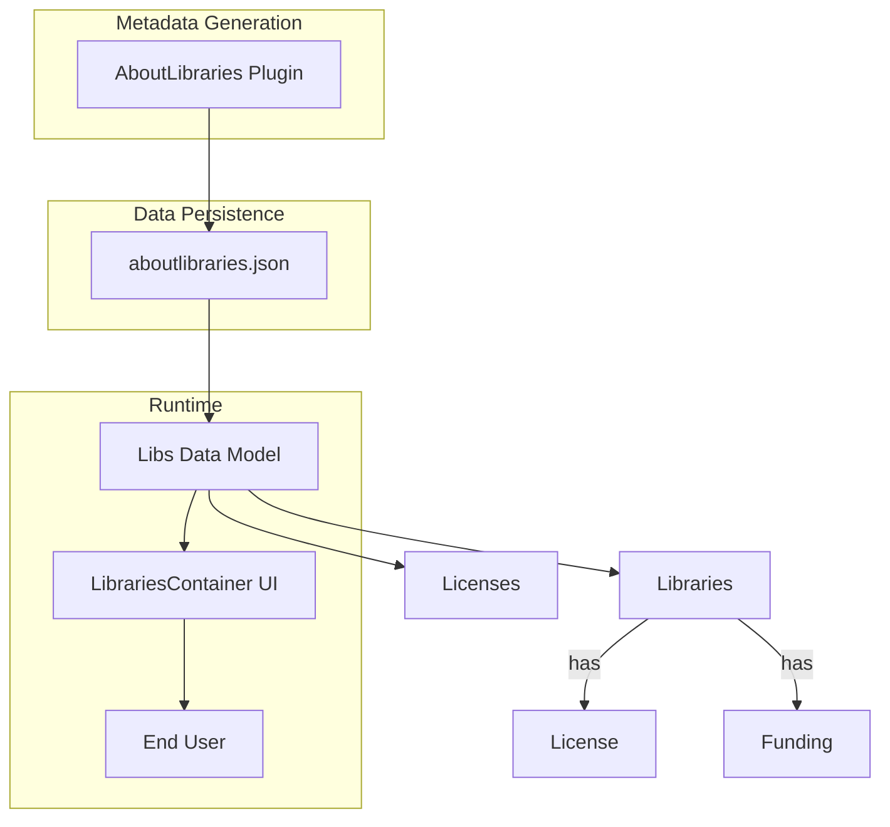

# Core Concepts & Terminology

Welcome to the foundational guide on the core concepts and terminology used in the AboutLibraries ecosystem. Understanding these key terms will empower you to confidently navigate the data structures and workflows involved in managing library metadata, licenses, and funding information.

---

## Library Metadata

At the heart of AboutLibraries is the accurate collection and representation of **Library Metadata**. This metadata is comprehensive information about each third-party software library your project depends upon. It includes everything you need to document licensing, authorship, versioning, and more.

**What does Library Metadata contain?**
- Unique identifier (e.g., Maven coordinates like `groupId:artifactId`)
- Library name and description
- Version information (artifact version)
- Source code management (SCM) URLs and connection details
- Developers and contributors
- Organizational ownership
- Associated licenses
- Optional funding sources

This metadata is automatically collected during your build process by the AboutLibraries Gradle plugin and output into a structured JSON file, typically named `aboutlibraries.json`, which is used for runtime visualization or compliance tasks.


## License

A **License** in AboutLibraries represents the legal terms under which a software library is distributed. Proper license identification and retrieval enable your project to comply with legal requirements and transparently attribute the software you use.

Key points about Licenses:
- Identified by SPDX identifiers or unique hash keys
- Contain full license text and URLs for reference
- Related to one or more libraries
- Can be configured for strict compliance checks

By integrating license data in the library metadata, AboutLibraries helps you easily generate license acknowledgments and detect unapproved or unsupported licenses early in your build or CI pipeline.

## Funding

**Funding** refers to the sources, platforms, or methods by which open source libraries receive financial support. AboutLibraries supports capturing funding information to raise awareness of how libraries are sustained.

Funding metadata may include:
- Funding platform (e.g., GitHub Sponsors, Open Collective)
- URLs where contributions can be made
- Contact and organizational data tied to the funding

This information can be surfaced in your app or documentation to encourage support for the open source community.

## aboutlibraries.json

The **`aboutlibraries.json`** file is the central JSON data file generated by the Gradle plugin during build time. It acts as a snapshot of all collected metadata for your project’s dependencies.

This file contains:
- A list of all `Libraries` detected in the project
- A dictionary of all `Licenses` referenced by the libraries
- Optional funding and developer information

Typically, this JSON file is serialized with pretty printing to improve readability and is placed in resource directories for use at runtime, such as in Compose UI components.


## Libs

**`Libs`** is the core data model representing the entire collection of library metadata loaded from `aboutlibraries.json`. It acts as a container aggregating:

- All detected third-party libraries
- Their associated licenses
- License texts and metadata
- Funding information

In code, `Libs` provides APIs and builders that allow you to read, query, and manipulate this information programmatically. For example, you might filter libraries by license type or display their data in your app’s UI.

```kotlin
val libs: Libs = Libs.Builder().fromFile("aboutlibraries.json").build()
// Access all libraries
val allLibraries = libs.libraries
``` 

This encapsulation streamlines data handling for developers seeking to integrate AboutLibraries data.

## LibrariesContainer

The **`LibrariesContainer`** is a Compose UI component that serves as a visual and interactive container for the loaded `Libs` data. It provides a scaffold to display a curated list of libraries with detailed metadata and licensing information.

Features of `LibrariesContainer` include:
- Searchable and filterable library lists
- Grouping by license, organization, or other criteria
- Configurable UI styling and behavior for integration

By connecting `Libs` with `LibrariesContainer`, you can seamlessly present your third-party attributions within your application’s user interface, enabling transparency and license compliance directly to your end-users.

---

## How These Concepts Fit Together

Below is an overview of the key elements and their relationships within AboutLibraries.



**Process flow:**
1. The AboutLibraries plugin runs during your build, gathering dependency metadata.
2. It generates the `aboutlibraries.json` file encapsulating all collected data.
3. At runtime, your app loads this JSON file into the `Libs` model.
4. The `LibrariesContainer` UI component displays the libraries, their licenses, and funding info to your users.

---

## Practical Tips

- **Always review licenses:** Understand the licenses of your dependencies to ensure compliance.
- **Customize `aboutlibraries.json` output:** Use Gradle plugin configuration to include or exclude metadata as needed.
- **Keep dependencies updated:** Regular updates will reflect latest library versions and license changes.
- **Utilize funding info:** Encourage supports by displaying funding links in your app UI.
- **Leverage strict mode:** Enable license strict mode to enforce license compliance at build time.

---

## Common Pitfalls

- Forgetting to regenerate `aboutlibraries.json` after dependency changes—your metadata may become outdated.
- Ignoring license compliance warnings reported by the plugin.
- Misinterpreting license details without reading the full license text.
- Missing funding metadata due to disabled remote fetch settings.

By mastering these core concepts, you establish a strong foundation to effectively utilize AboutLibraries in your projects with confidence and legal respect.

---

For more on how these pieces connect to the broader architecture, visit [System Architecture Overview](../architecture-core-concepts/system-architecture).

For API details on `Libs` and `LibrariesContainer`, see [Libs Main Container and Builder](../../api-reference/core-data-models/libs-entity-reference) and [LibrariesContainer & LibrariesScaffold](../../api-reference/compose-api/compose-librariescontainer-api).
