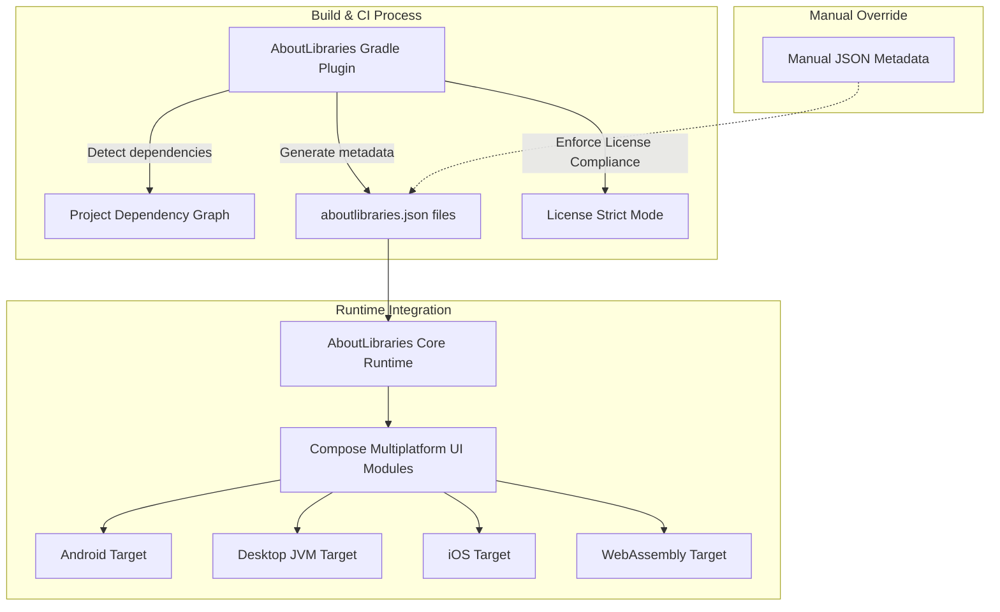

# Ecosystem & Integration Points

Explore how AboutLibraries seamlessly fits into your broader development ecosystem, providing comprehensive Gradle plugin integration, multiplatform Compose UI support, and flexible manual JSON metadata management. This page highlights the key integration touchpoints that maximize compatibility and streamline your legal compliance and attribution workflows across Android, Desktop, iOS, and Web platforms.

---

## AboutLibraries in Your Build and CI Ecosystem

AboutLibraries is designed as a build-time automation tool that transparently collects and exports third-party library metadata throughout your app's lifecycle. It thrives on deep Gradle integration and offers multiplatform support for Compose UI environments, empowering you to automate compliance without runtime overhead.

### Gradle Plugin Integration

The cornerstone for AboutLibraries' metadata generation is its robust Gradle plugin, which integrates directly into your build process to:

- **Detect dependencies automatically:** It introspects your project’s dependency graphs (including variant filtering for Android flavors) to gather library and license details.
- **Generate comprehensive metadata:** Creates `aboutlibraries.json` files capturing licenses, funding, developers, and associated information.
- **Enforce license compliance:** Enables strict mode build failures for unauthorized licenses, ensuring legal compliance before release.
- **Customizable outputs:** Supports multiple export configurations (e.g., Android, Desktop, wasmJs) to accommodate different platform targets.

Example snippet from a project configuration:

```kotlin
aboutLibraries {
    collect {
        configPath = file("../config")
        gitHubApiToken = if (hasProperty("github.pat")) property("github.pat")?.toString() else null
        fetchRemoteLicense = false
    }
    export {
        prettyPrint = true
        outputFile = file("src/androidMain/composeResources/files/aboutlibraries.json")
    }
    exports {
        create("desktop") {
            prettyPrint = true
            outputFile = file("src/desktopMain/composeResources/files/aboutlibraries.json")
        }
        create("wasmJs") {
            prettyPrint = true
            outputFile = file("src/wasmJsMain/composeResources/files/aboutlibraries.json")
        }
    }
    license {
        strictMode = StrictMode.FAIL
        allowedLicenses.addAll("Apache-2.0", "MIT")
    }
    library {
        duplicationMode = DuplicateMode.LINK
        duplicationRule = DuplicateRule.SIMPLE
    }
}
```

This Gradle plugin orchestration ensures your metadata is consistent, accurate, and readily consumable by AboutLibraries runtime components.

### Compose Multiplatform Support

AboutLibraries embraces the Compose Multiplatform ecosystem, providing:

- **Jetpack Compose UI integration:** Through separate modules targeting Material2 & Material3, and core AboutLibraries data structs enabling a smooth display and interaction with license data.
- **Platform targeting:** Support for Android, Desktop (JVM), iOS, and Browser/WebAssembly.
- **Modular Gradle configurations:** Source sets split by platform allow tailored dependency management and UI features, such as tooling previews or debug implementation.

The multiplatform Gradle build setup reflects this:

```kotlin
kotlin {
    androidTarget()
    iosX64()
    iosArm64()
    iosSimulatorArm64()
    jvm("desktop")
    wasmJs {
        browser {
            commonWebpackConfig {
                outputFileName = "composeApp.js"
            }
        }
        binaries.executable()
    }

    sourceSets {
        val commonMain by getting {
            dependencies {
                implementation(project(":aboutlibraries-core"))
                implementation(compose.runtime)
                implementation(compose.foundation)
                implementation(compose.material)
            }
        }
        val androidMain by getting
        val desktopMain by getting
        // other platform specific source sets...
    }
}
```

This architecture empowers developers to consume and render AboutLibraries metadata natively in Compose UI apps, ensuring consistent attribution across platforms with minimal integration effort.

### Android Application Integration

Because AboutLibraries is deeply Android-customizable, its standard Android module supports:

- View binding for UI which helps embed license information in traditional Android layouts.
- Inclusion of commonly used Android dependencies like RecyclerView, CardView, and Material Components, enabling rich displays of library attributions.
- Compatibility with commonly adopted libraries such as MaterialDrawer for navigation and Iconics for icon font support, improving UI experience.

The `app/build.gradle.kts` exemplifies how AboutLibraries is embedded in an Android/Dekstop sample app alongside these dependencies.

### Manual JSON Metadata Management

Beyond automatic Gradle collection, AboutLibraries allows manual management of `aboutlibraries.json` files:

- Store JSON metadata in platform-specific Compose resources for Android, Desktop, or wasmJs.
- Customize funding, license, and library details through manual JSON configurations, allowing enterprises or CI systems to inject curated compliance data.
- Supplement or override metadata fetched at build time, enhancing flexibility when integrating third-party or custom libraries.

Example JSON snippet (stored under `src/desktopMain/composeResources/files/aboutlibraries.json`):

```json
{
  "libraries": [
    {
      "uniqueId": "androidx.annotation:annotation",
      "name": "Annotation",
      "artifactVersion": "1.8.0",
      "licenses": ["Apache-2.0"],
      "developers": [{ "name": "The Android Open Source Project" }],
      "description": "Provides source annotations for tooling and readability."
    }
  ]
}
```

This manual option enables advanced CI workflows and enterprise needs where build environments or dependency sources differ.

### Compliance and License Reporting

AboutLibraries integrates license detection and strict mode enforcement right into your builds, providing:

- Automatic build failure on use of disallowed licenses, keeping compliance in check.
- Configuration maps to relax or tighten license enforcement based on individual dependencies.
- Automated fetching and inclusion of license texts, reducing manual legal work.

##### Best Practices:

- Enable strict mode during CI builds to block unauthorized licenses early.
- Use `allowedLicensesMap` for exceptions and fine-grained control.
- Combine with manual JSON overrides for enterprise licenses or custom libraries.


---

## Architecture Overview Diagram



---

## Practical Integration Tips

- **Centralize your plugin configuration** in your root or app module for consistent builds.
- **Leverage multiplatform source sets** to manage dependencies clearly and avoid duplication issues.
- **Use manual JSON overrides** when third-party data is incomplete or you must comply with enterprise policies.
- **Test strict mode locally** to catch license issues early.
- **Keep Compose UI modules updated** to maintain compatibility with latest Compose Multiplatform releases.

---

## Troubleshooting Common Integration Scenarios

<AccordionGroup title="Common Issues and Solutions">
<Accordion title="License Compliance Build Failures">
If your build fails due to new or missing licenses:
- Review the `allowedLicenses` in your Gradle configuration.
- Use `allowedLicensesMap` to approve exceptions per dependency.
- Ensure GitHub API token is configured if remote fetching is needed.
- Manually add missing licenses or funding info in JSON configs when necessary.
</Accordion>
<Accordion title="Multiplatform SourceSet Dependency Errors">
If dependencies are not recognized or cause conflicts:
- Confirm your source set hierarchy matches the official `kotlin {}` setup.
- Make sure platform-specific dependencies don’t leak into commonMain.
- Use Gradle tooling and logs to track unrecognized or duplicated libraries.
</Accordion>
<Accordion title="JSON Metadata Not Found at Runtime">
- Verify `aboutlibraries.json` is generated and placed in the correct resource path per platform.
- Check your `export` configuration in the Gradle plugin for correct output paths.
- Validate resource packaging rules exclude the JSON file.
</Accordion>
</AccordionGroup>

---

## Next Steps

- Dive into [Getting Started guides](/getting-started/prerequisites-installation/install-gradle-plugin) to set up your project efficiently.
- Explore the [System Architecture Overview](/overview/architecture-core-concepts/system-architecture) for a deeper technical understanding.
- Consult the [Feature Overview](/overview/aboutlibraries-intro/feature-summary) to unlock all AboutLibraries capabilities.
- Review [Compliance and License Strict Mode](/guides/best-practices-workarounds/compliance-and-license-strict-mode) to manage legal risks confidently.

---

## Related Information

- [What is AboutLibraries?](/overview/aboutlibraries-intro/what-is-aboutlibraries)
- [Core Data Models API Reference](/api-reference/core-data-models/library-license-entities)
- [Gradle Plugin Tasks & Configuration](/api-reference/gradle-plugin-api/plugin-tasks-and-configuration)
- [Compose API Usage and Customization](/api-reference/compose-api/compose-components-customization)


---

This page empowers you to leverage AboutLibraries deeply in your build and deployment pipelines — maximizing automation, compliance, and user transparency across platforms.