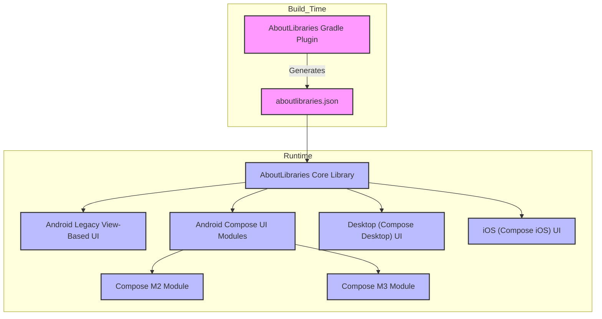

# System Architecture Overview

Discover how AboutLibraries orchestrates the seamless generation, loading, and presentation of comprehensive dependency metadata across multiple platforms. This documentation visualizes the flow of data starting from the Gradle plugin's generation of `aboutlibraries.json` to runtime consumption by core and Compose UI modules, illuminating integration points for Android, Desktop, iOS, and beyond.

---

## Visualizing AboutLibraries Architecture

AboutLibraries is designed as a cohesive system blending build time automation with runtime UI integrations, enabling developers to effortlessly comply with open source licenses and present detailed dependency information within their apps.

At its core, the system functions through three key stages:

1. **Metadata Generation (Build Time)**
   - The AboutLibraries Gradle plugin scans your project's dependencies during build.
   - It compiles comprehensive metadata including library identifiers, licenses, developers, repositories, and funding details.
   - This metadata is serialized into the `aboutlibraries.json` file embedded within the app.

2. **Core Library Loading (Runtime)**
   - The runtime core module reads the `aboutlibraries.json` metadata to deserialize and prepare library data.
   - This core serves as a platform-neutral foundation ensuring consistent library data access across supporting platforms (Android, Desktop, iOS, etc.).

3. **UI Layer Integration (Runtime)**
   - Platform-specific UI modules consume core data to render rich, informative library lists and license details.
   - On Android, legacy View-based and modern Compose UI components provide highly customizable ways to display attribution.
   - Compose UI integration extends multiplatform support, with dedicated modules for Material2 and Material3 styles.

### System Architecture Flowchart

## Components Explained

### AboutLibraries Gradle Plugin

- **Purpose**: Automates extraction of library metadata during project builds.
- **Output**: Produces a machine-readable `aboutlibraries.json` embedded into the app.
- **Outcome**: Eliminates manual tracking of dependencies and license texts.

### Runtime Core Library

- **Purpose**: Centralized library data loader and model manager.
- **Function**: Parses JSON metadata to provide structured, accessible library information.
- **Platform**: Pure Kotlin core built to support multiplatform consumption.

### UI Layers

- **Android Legacy View-Based UI**: Provides classic activities and fragments with adapter-driven RecyclerViews displaying library details.
- **Android Compose UI Modules**: Modern reactive UI components designed for ease of integration and customization, supporting Material2 and Material3 design languages.
- **Multiplatform Compose UI (Desktop, iOS)**: Enables consistent UI experience across desktop and iOS using Compose Multiplatform.

## Integration Points and Extensibility

- Android apps can choose between legacy views or Compose UI for a seamless experience.
- Desktop and iOS integrations reuse the core data layer, maximizing code sharing and reducing duplication.
- Compose UI modules are isolated and composable, allowing developers to override UI styling and behaviors easily.

## Real-World Scenario: Android App Using AboutLibraries

Imagine you want to display an "About Third-Party Libraries" screen that complies with legal requirements without manual effort:

- During build, the Gradle plugin scans your project’s dependencies, fetching metadata and creating `aboutlibraries.json`.
- At runtime, the AboutLibraries Core loads this data.
- Using the Compose UI module (Material3), your app renders a fast, searchable, and styled libraries list with license details automatically.
- Users can tap any library to get its full description and license, ensuring transparency and compliance.

## Practical Tips & Best Practices

- **Keep Gradle Plugin Updated**: New plugin versions improve metadata accuracy and support newer license types.
- **Leverage Compose Customization**: Use compose modules to blend AboutLibraries UI into your app’s branding seamlessly.
- **Enable Multiplatform Usage**: For KMM apps, reuse the core library and Compose UI components to shorten development timelines.
- **Handle Missing or Custom Libraries**: The system allows manual additions or overrides for unusual or private dependencies.

## Troubleshooting Common Issues

- **Metadata Not Updating?**
  - Ensure Gradle plugin tasks run during build.
  - Clean and rebuild your project to regenerate `aboutlibraries.json`.

- **UI Not Displaying Libraries Correctly?**
  - Verify that the runtime modules are correctly included.
  - Check for mismatched library versions between build time and runtime.

- **Licenses Not Showing?**
  - Confirm that licenses are included in dependency metadata.
  - Customize `LibsBuilder` flags to enable license dialogs and visibility.

## Getting Started Preview

Step into integration by:

1. Adding the AboutLibraries Gradle plugin to your build setup.
2. Generating the dependency metadata via the plugin’s task.
3. Including the runtime core and one of the UI modules (legacy or Compose) in your app.
4. Launching sample screens that visualize all detected dependencies with license details.

---

For comprehensive guidance on setup and usage, explore the [Getting Started](/getting-started/prerequisites-installation/install-gradle-plugin) and [Feature Overview](/overview/aboutlibraries-intro/feature-summary) pages.

---

### Source Reference

For in-depth technical details, see the runtime core library and UI components source code in the [GitHub repository](https://github.com/mikepenz/AboutLibraries).

---

This architecture overview demonstrates AboutLibraries’ commitment to streamlining compliance workflows, providing a trusted, scalable solution that seamlessly integrates into modern multiplatform app development.

---